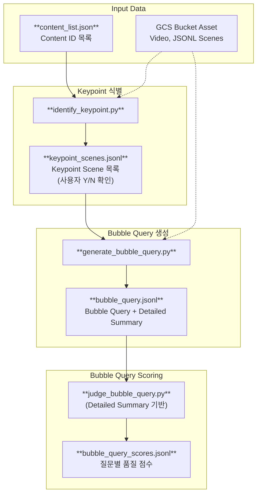
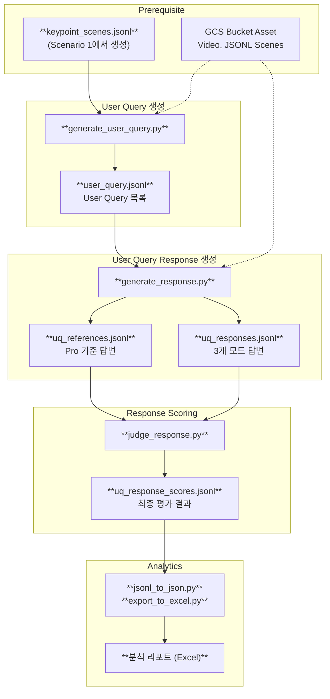

# LLMJudge (Multimodal Interactive Evaluation)

Google Cloud Storage(GCS)에 저장된 영상 및 메타데이터를 활용하여 **실시간 시청 상황을 모사한** 고도화된 질의응답 및 자동 평가 파이프라인(CLI)입니다.

## 📝 프로젝트 개요

이 프로젝트는 시청자가 영상을 중간까지 보다가 질문을 남길 만한 핵심 씬 (Keypoint Scene)을 식별하고, 해당 시점까지의 **과거 맥락(Past)** 과 **현재 장면(Current Focus)** 을 분리하여 분석합니다. 두 가지 유형의 질문을 생성하고, 각각에 적합한 평가 프로세스를 적용합니다.

- **Bubble Query**: 현재 장면에 보이는 것만으로 생성되는 시청자의 즉각적인 궁금증 (장면 중심)
  - Keypoint 식별 → Bubble Query 생성 → Detailed Summary 기반 Query 품질 평가 (Scoring)
- **User Query**: 지금까지 누적해서 본 전체 맥락에서 자연스럽게 발생하는 종합적인 질문 (맥락 중심)
  - 식별된 Keypoint 재사용 → User Query 생성 → 3개 모드(Video/Full/Part) 답변 생성 → Reference 기반 답변 평가

## 🔄 파이프라인 흐름

### Scenario 1. Bubble Query Generation & Scoring



### Scenario 2. User Query Generation, Response Generation & Scoring



### 파이프라인 요약

| Step | 스크립트 | Source | Output | 모델 |
|------|----------|------|------|------|
| A-1 | `identify_keypoint.py` | Video+Ref JSON | `keypoint_scenes.jsonl` | Flash |
| A-2 | `generate_bubble_query.py` | Query: Full/Part JSON</br>Summary: Video+Ref JSON | `bubble_query.jsonl` | Flash (Query), Pro (Summary) |
| A-3 | `judge_bubble_query.py` | Query, Summary+Ref JSON | `bubble_query_scores.jsonl` | Pro |
| B-1 | `generate_user_query.py` | Video+Ref JSON | `user_query.jsonl` | Pro |
| B-2 | `generate_response.py` | Video/Full/Part JSON | `uq_responses.jsonl`, `uq_references.jsonl` | Flash (Response), Pro (Reference) |
| B-3 | `judge_response.py` | Response, Reference | `uq_response_scores.jsonl` | Pro |
| B-4 | `jsonl_to_json.py` / `export_to_excel.py` | `uq_response_scores.jsonl` | Excel 리포트 | — |

## ✨ 주요 특징

### 1. Bubble Query & User Query 이중 구조
- **Bubble Query** (현재 장면 중심): 현재 장면의 시각적 요소, 대사, 행동에만 기반한 즉각적인 질문. Detailed Summary와 함께 생성되어 텍스트 기반 품질 평가(Scoring)를 받습니다.
- **User Query** (누적 맥락 중심): 과거~현재까지 본 전체 내용을 종합한 맥락적 질문. 답변 생성 및 Reference 기반 평가로 이어집니다.

### 2. Past/Current Context 분할 전략
시청자의 인지 과정을 모사하기 위해 데이터를 두 구간으로 나누어 모델에 제공합니다.
- **과거 정보 (Past Information)**: `[0s ~ 현재 Scene 시작]` 구간의 영상/메타데이터. 상황 맥락 파악용.
- **현재 정보 (Current Information)**: `[현재 Scene 시작 ~ end_time]` 구간의 영상/메타데이터. 질문/답변의 직접적인 근거.

### 3. 메타데이터 교차 검증 프롬프트
Reference 메타데이터(speech, texts, sounds)는 자동 추출된 값으로 오류가 포함될 수 있습니다.
모든 프롬프트에 **메타데이터 사용 시 주의사항**을 내장하여, 비디오 프레임의 시각 정보를 우선 참고하고 메타데이터는 보조 자료로만 활용하도록 유도합니다.

### 4. 다중 모드(Multi-mode) 추론 및 평가
- `Video`: 원본 비디오 파일(.mp4)만 제공
- `Full`: 오디오 분류 + ASR + OCR + 행동 묘사(Description) 포함 JSONL
- `Part`: Full에서 행동 묘사를 제외한 JSONL
- **Reference 기반 독립 평가**: Pro 모델이 생성한 기준 정답(텍스트)만으로 비교 평가하여 Judge 단계의 비용과 속도를 최적화했습니다.

### 5. 운영 안정성 및 효율성
- **쿼리 단위 Resume**: (content_id, query) 단위로 실시간 저장. 중단 후 재실행 시 잔여 작업만 처리.
- **자동 재시도 (Retry Loop)**: API Rate Limit(429) 등 일시적 오류 발생 시 성공할 때까지 자동 재시도.
- **병렬 파이프라인 (`--continuous`)**: 각 단계를 독립 터미널에서 동시에 실행 가능.

## 🗂 파일 구조

```text
LLMJudge/
├── main.py                       # E2E 파이프라인 오케스트레이터
├── identify_keypoint.py          # Keypoint Scene 식별 (사용자 Y/N 확인 후 저장)
├── generate_bubble_query.py      # Keypoint 입력 → Bubble Query & Summary 생성
├── generate_user_query.py        # Keypoint 입력 → User Query 생성
├── judge_query.py                # Bubble Query 품질 평가 (Scoring)
├── generate_response.py          # User Query → Reference + 3모드 답변 생성
├── judge_response.py             # User Query 답변에 대한 품질 평가 (Scoring)
├── gemini_api_utils.py           # Gemini SDK, GCS 검증, 재시도 등 공통 유틸
├── jsonl_to_json.py              # JSONL → 분석용 JSON 변환
├── aggregate_scores.py           # 점수 집계
├── export_to_excel.py            # Excel 리포트 생성
├── config.json                   # 환경 설정 (GCP, 모델명 등)
├── content_list.json             # 평가 대상 Content ID 목록
└── assets/                       # 파이프라인 중간 결과 및 최종 스코어
    ├── keypoint_scenes.jsonl
    ├── bubble_query.jsonl
    ├── bubble_query_scores.jsonl
    ├── user_query.jsonl
    ├── uq_responses.jsonl
    ├── uq_references.jsonl
    └── uq_response_scores.jsonl
```

## 🚀 설치 및 사전 준비

1. **Python 패키지 설치**
   ```bash
   pip install google-cloud-aiplatform google-cloud-storage vertexai pandas openpyxl
   ```

2. **GCP 인증 및 설정**
   ```bash
   gcloud auth application-default login
   ```
   `config.json`에 GCP 프로젝트 ID와 GCS 버킷 이름을 설정하세요.

3. **GCS 데이터 구조**
   ```text
   gs://{bucket}/video_540p/{content_id}_540p.mp4
   gs://{bucket}/jsonl/{content_id}_15s_Full.jsonl  # 또는 _Ref.jsonl
   ```

## 🎯 실행 방법

### 통합 실행
```bash
# 전체 파이프라인 실행
python main.py --input_file content_list.json

# Keypoint 식별만 대화형으로 실행 (A-1만)
python main.py --skip-bubble-query-gen --skip-query-judge --skip-user-query-gen --skip-response --skip-judge

# Keypoint 식별 결과가 있고 Query 생성부터 시작
python main.py --skip-keypoint

# A 트랙(Bubble Query)만 실행 (B 트랙 전체 건너뛰기)
python main.py --skip-user-query-gen --skip-response --skip-judge

# B 트랙(User Query)만 실행 (A 트랙 건너뛰기, Keypoint 결과 필요)
python main.py --skip-keypoint --skip-bubble-query-gen --skip-query-judge

# Query 생성 건너뛰고 이후 답변/평가만
python main.py --skip-keypoint --skip-bubble-query-gen --skip-query-judge --skip-user-query-gen
```

### 각 모듈 개별 실행
```bash
# A-1: Keypoint Scene 식별
python identify_keypoint.py

# A-2: Bubble Query 생성 (Keypoint 입력)
python generate_bubble_query.py

# A-3: Bubble Query 품질 Judge
python judge_bubble_query.py

# B-1: User Query 생성 (Keypoint 입력)
python generate_user_query.py

# B-2: User Query 답변 생성 (실시간 모니터링 모드 가능)
python generate_response.py --continuous

# B-3: 답변 Judge (실시간 모니터링 모드 가능)
python judge_response.py --continuous
```

## 📊 출력 데이터 상세 예시 (assets/)

### 1. `bubble_query.jsonl` (Bubble Query 생성 결과)
```json
{
  "content_id": "v001",
  "queries": [
    {
      "scene_idx": 5,
      "query": "방금 저 사람이 들고 있던 게 뭐야?",
      "start_time": 120.0,
      "end_time": 135.2,
      "detailed_summary": "영상은 주인공이 시장에 도착하여..."
    }
  ]
}
```

### 2. `user_query.jsonl` (User Query 생성 결과)
```json
{
  "content_id": "v001",
  "queries": [
    {
      "scene_idx": 5,
      "query": "앞에서 나왔던 사건이 지금이랑 연관 있는 거야?",
      "start_time": 120.0,
      "end_time": 135.2
    }
  ]
}
```

### 3. `uq_responses.jsonl` (User Query 답변 생성 결과)
```json
{
  "content_id": "v001",
  "query": "앞에서 나왔던 사건이 지금이랑 연관 있는 거야?",
  "scene_idx": 5,
  "start_time": 120.0,
  "end_time": 135.2,
  "answers": { "video": "...", "full": "...", "part": "..." }
}
```

### 4. `uq_references.jsonl` (User Query Reference 답변)
```json
{
  "content_id": "v001",
  "query": "앞에서 나왔던 사건이 지금이랑 연관 있는 거야?",
  "scene_idx": 5,
  "start_time": 120.0,
  "end_time": 135.2,
  "reference": "초반에 주인공이 지도를 잃어버리는 장면이 복선으로, 지금 길을 헤매는 상황과 직접적으로 연결됩니다."
}
```

### 5. `uq_response_scores.jsonl` (최종 평가 결과)
```json
{
  "content_id": "v001",
  "query": "앞에서 나왔던 사건이 지금이랑 연관 있는 거야?",
  "scene_idx": 5,
  "mode": "video",
  "answer": "...",
  "reference": "...",
  "judge": {
    "rationale": "답변이 Reference의 핵심을 잘 포착했으나 구체적인 장면 묘사가 부족함.",
    "scores": {
      "accuracy": 4,
      "completeness": 3,
      "helpfulness": 4
    },
    "total_score": 11
  }
}
```

## 📈 분석 결과 확인

파이프라인 완료 후 `results/` 디렉토리에서 시각화된 분석 결과를 확인할 수 있습니다.

```bash
python jsonl_to_json.py    # JSONL → JSON 변환
python aggregate_scores.py # 점수 집계
python export_to_excel.py  # Excel 리포트 생성
```

| 파일 | 내용 |
|------|------|
| `results/details.xlsx` | 질문별·모드별 상세 점수 및 답변 비교 |
| `results/scores.xlsx` | 모드별 평균 점수 종합 요약 |

평가 기준: **정확성(Accuracy)**, **포괄성(Completeness)**, **가독성(Helpfulness)** — 각 1~5점, 총 15점 만점.

