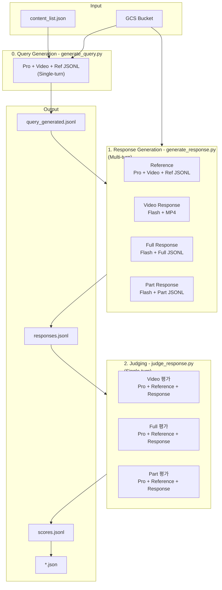

# LLMJudge

Google Cloud Storage(GCS)에 저장된 영상 및 메타데이터를 활용하여 Google Gemini 모델 기반 질의응답을 수행하고, 또 다른 강력한 Gemini 모델을 통해 답변의 품질을 자동 평가하는 파이프라인(CLI)입니다.

## 📝 프로젝트 개요

이 프로젝트는 긴 비디오 영상과 15초 단위 멀티모달 메타데이터(JSONL)를 Gemini 모델에 입력하여 사용자 질문에 대한 답변을 생성하고, Judge 모델을 통해 자동으로 채점합니다.

평가 기준: **정확성(Accuracy)**, **포괄성(Completeness)**, **가독성(Helpfulness)** — 각 1~5점, 총 15점 만점.

## 🔄 파이프라인 흐름



> **Note**: Judge 단계에서는 비디오를 재전송하지 않고, Stage 1에서 생성된 **Reference Answer(텍스트)** 만을 기준으로 각 모드 답변을 비교 평가합니다.

### 세션 구조 상세

| 단계 | 세션 구조 | 비고 |
|------|----------|------|
| Query 생성 | Content 당 1회 호출 (`generate_content`) | Single-turn |
| Reference 생성 | Content 당 1 Chat Session, 쿼리별 Multi-turn | 첫 턴에 Video+Ref JSONL 전송 |
| Response 생성 | Mode별 1 Chat Session × 3, 쿼리별 Multi-turn | 첫 턴에 파일 전송, 이후 텍스트만 |
| Judge 평가 | **(query, mode)별 독립 세션** | 이전 평가 history 영향 없음 |

## ✨ 주요 특징

- **Reference Answer 기반 평가**: Pro 모델이 원본 비디오 + Ref 메타데이터를 참조하여 **기준 정답을 1회 생성**. Judge 모델은 이 텍스트만으로 비교 평가 → **Judge 단계 비디오 토큰 100% 제거**.
- **다중 모드(Multi-mode) 추론**:
  - `video`: 원본 비디오 파일(.mp4)만 제공
  - `full`: 오디오 분류 + 음성 인식 + OCR + 행동 묘사(Description) 포함 JSONL
  - `part`: 행동 묘사를 제외한 메타데이터 JSONL
- **쿼리 단위 Resume**: (content_id, query) 단위로 실시간 JSONL Append. 중단 후 재실행 시 잔여 작업만 처리.
- **재시도(Exponential Backoff)**: API Rate Limit 등 일시적 오류에 대해 자동 복구.
- **비동기 병렬 파이프라인 (`--continuous`)**: 각 단계를 독립 터미널에서 동시에 실행하여 이전 단계 출력을 실시간 모니터링.

## 🗂 파일 구조

```text
LLMJudge/
├── main.py                     # E2E 파이프라인 오케스트레이터
├── generate_query.py           # 질문 자동 생성
├── generate_response.py        # Reference + 3모드 답변 생성
├── judge_response.py           # Reference 기반 비교 평가
├── gemini_api_utils.py         # Gemini SDK, GCS 검증, 재시도 등 공통 유틸
├── jsonl_to_json.py            # JSONL → 분석용 JSON 변환
├── config.json                 # 환경 설정 (GCP, 모델명 등)
├── content_list.json           # 평가 대상 Content ID 목록
└── output/                     # 파이프라인 결과 저장
    ├── query_generated.jsonl   # 0️⃣ 생성된 질문
    ├── responses.jsonl         # 1️⃣ Reference + 3모드 답변
    └── scores.jsonl            # 2️⃣ 최종 평가 점수
```

## 🚀 설치 및 사전 준비

1. **Python 패키지 설치**
   ```bash
   pip install google-cloud-aiplatform google-cloud-storage vertexai
   ```

2. **GCP 인증**
   ```bash
   gcloud auth application-default login
   ```

3. **설정 파일 생성**
   ```bash
   cp sample_config.json config.json
   # config.json에서 본인의 GCP Project ID, Bucket Name 등 수정
   ```

4. **GCS 데이터 구조**
   컨텐츠 하나 당 4개의 파일이 필요합니다:
   ```text
   gs://{BUCKET}/video_540p/{content_id}_540p.mp4
   gs://{BUCKET}/jsonl/{content_id}_15s_Full.jsonl
   gs://{BUCKET}/jsonl/{content_id}_15s_Part.jsonl
   gs://{BUCKET}/jsonl/{content_id}_15s_Ref.jsonl
   ```

## 🎯 실행 방법

### A. 일괄 실행 (순차 진행)

```bash
# Content ID만 있는 경우 (E2E)
python main.py --generate-query --input_file content_list.json

# Query가 이미 있는 JSONL 파일 입력
python main.py --input_file output/query_generated.jsonl
```

### B. 병렬 파이프라인 (`--continuous`)

3개 터미널에서 각각 실행:
```bash
# 터미널 1: 질문 생성
python generate_query.py --input_file content_list.json

# 터미널 2: 답변 생성 (실시간 모니터링)
python generate_response.py --continuous

# 터미널 3: 평가 (실시간 모니터링)
python judge_response.py --continuous
```

### 주요 옵션

| 옵션 | 설명 | 기본값 |
|------|------|--------|
| `--reference_model` | Reference Answer 생성 모델 | `gemini-2.5-pro` |
| `--response_gen_model` | 3모드 답변 생성 모델 | `gemini-2.5-flash` |
| `--judge_model` | 평가 모델 | `gemini-2.5-pro` |
| `--no-reference-ref` | Reference 생성 시 Ref JSONL 미참조 (Video만 사용) | OFF (Ref 참조) |
| `--skip-response` | 답변 생성 단계 건너뛰기 | — |
| `--skip-judge` | 평가 단계 건너뛰기 | — |

### `config.json` 통합 설정

```json
{
  "gcp_project_id": "your-project-id",
  "gs_bucket_name": "your-bucket-name",
  "location": "global",
  "query_gen_model": "gemini-3.1-pro-preview",
  "response_gen_model": "gemini-2.5-flash",
  "reference_model": "gemini-3.1-pro-preview",
  "judge_model": "gemini-3.1-pro-preview"
}
```
CLI 인자가 항상 `config.json`보다 우선 적용됩니다.

### 분석용 JSON 변환

```bash
python jsonl_to_json.py
```

## 📊 출력 포맷 예시

### `responses.jsonl` (쿼리 1건 = 1줄)
```json
{
  "content_id": "001_NatGeoKR_Narwhal_6m",
  "query": "이 영상에서 일각돌고래가 뭐 하는 거야?",
  "reference": "Pro 모델이 생성한 기준 정답 텍스트...",
  "answers": {
    "video": "영상을 직접 분석한 답변...",
    "full": "Full 메타데이터 기반 답변...",
    "part": "Part 메타데이터 기반 답변..."
  }
}
```

### `scores.jsonl` (쿼리 1건 = 1줄)
```json
{
  "content_id": "001_NatGeoKR_Narwhal_6m",
  "query": "이 영상에서 일각돌고래가 뭐 하는 거야?",
  "judge": {
    "video": { "rationale": "...", "scores": { "accuracy": 4, "completeness": 4, "helpfulness": 5 }, "total_score": 13 },
    "full":  { "rationale": "...", "scores": { "accuracy": 5, "completeness": 5, "helpfulness": 4 }, "total_score": 14 },
    "part":  { "rationale": "...", "scores": { "accuracy": 3, "completeness": 3, "helpfulness": 4 }, "total_score": 10 }
  }
}
```
