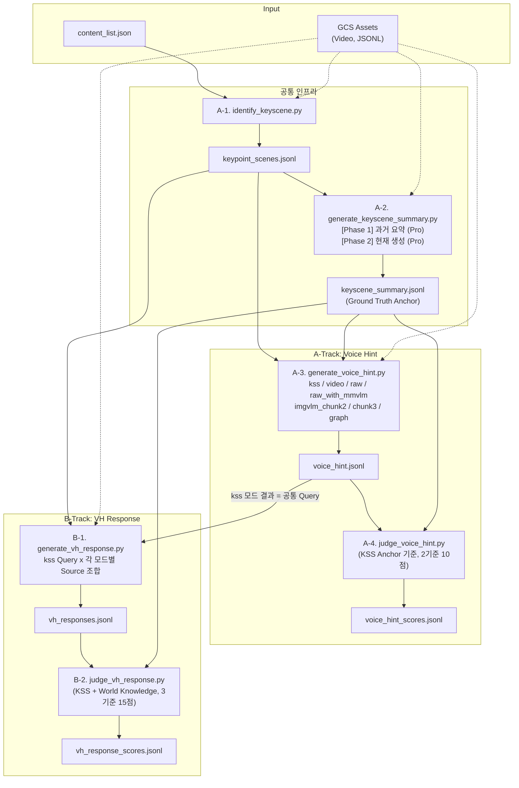

# LLMJudge (Multimodal Interactive Evaluation)

Google Cloud Storage(GCS)에 저장된 영상 및 메타데이터를 활용하여 **멀티모달 대화 시나리오 품질을** 자동으로 생성하고 평가 할 수 있는 자동화 파이프라인(CLI)입니다.

## 핵심 아키텍처 개요

이 파이프라인은 동영상의 시간적 구조를 기반으로 핵심 장면 구간 별 주요 전환 점(KeyScene)을 식별하고, 각각의 장면에서 **과거 맥락(Past)** 과 **현재 초점(Current Focus)** 을 결합하여 분석합니다. 2개의 트랙(A/B)으로 구성된 자동 평가프레임을 통해, 서로 다른 데이터소스 조건에서 동일한 질문을 던지고 답변의 품질을 비교하는 통제변인 실험을 수행합니다.

### 2-Track 평가체계

- **A-Track (Voice Hint)**: 7개 모드(kss, video, raw, raw_with_mmvlm, imgvlm_chunk2/chunk3/graph)의 Source를 기반으로 시청자의 호기심을 유발하는 질문을, KSS Anchor 기준으로 품질 평가
- **B-Track (VH Response)**: A-Track의 **kss 모드로 생성된 공통 Query**를 기준, 각 모드별 Source로 답변 생성 → KSS + World Knowledge 기반 품질 비교. 동일한 질문으로 데이터소스 간 **통제 실험**을 수행

---

## 저작권 안전한 데이터 구조 (Copyright-Safe Architecture)

이 파이프라인은 외부 모델 호출 시 원본의 **직접 재현이 불가능한 형태로 변환**합니다. 원저작 LLM이 생성한 설명문을 그대로 전송할 경우 저작물의 표현을 침해할 가능성이 있으므로, 구조화와 단편화 처리를 거쳐 전송 위험을 최소화합니다.

### 저작권 안전 처리 흐름: VLM 구조화 + 단편화 + 마스킹 (imgvlm)

`imgvlm` 모드는 온디바이스 VLM이 추출한 시각 메타데이터에 다단계 변환을 **비가역적으로 적용하여**, 원본 서술문/문장을 복원할 수 없는 형태로 가공합니다. 3단계 처리 프로세스는 다음과 같습니다:

1. **구조화 (Structuring)**: VLM 추출 원문을 의미 단위로 Subjects / Actions / Contexts 3개 카테고리로 분류
2. **2워드 단편화 (Bigram Fragmentation)**: 각 항목을 무작위로 2워드 단위로 잘라 내 원문 순서와의 대응을 완전히 제거
3. **고유명사 마스킹**: 작품명, 캐릭터명, 지명 등 식별자를 `[MASKED]` 토큰으로 대체

```
VLM 원문:  "A narwhal swims gracefully through the Arctic waters near ice floes"

구조화 + 단편화 후:
  Subjects: ["near ice", "A narwhal"]                    (셔플됨)
  Actions:  ["gracefully through", "swims [MASKED]"]     (단편화 + 마스킹)
  Contexts: ["ice floes", "the Arctic", "waters near"]   (셔플됨)
```

> **`raw` / `raw_with_mmvlm` 모드**는 원본 ASR/OCR를 그대로 사용하므로, **저작권 계약 완료된 컨텐츠에만 사용 가능한** 모드입니다.

## 전체 파이프라인 구성



### 파이프라인 요약

| Step | 스크립트 | Output | 모델 |
|------|----------|--------|------|
| A-1 | `identify_keyscene.py` | `keypoint_scenes.jsonl` | Flash Lite |
| A-2 | `generate_keyscene_summary.py` | `keyscene_summary.jsonl` | Pro → Pro |
| A-3 | `generate_voice_hint.py` | `voice_hint.jsonl` | Flash Lite |
| A-4 | `judge_voice_hint.py` | `voice_hint_scores.jsonl` | Pro |
| B-1 | `generate_vh_response.py` | `vh_responses.jsonl` | Flash Lite |
| B-2 | `judge_vh_response.py` | `vh_response_scores.jsonl` | Pro |
| - | `export_to_excel.py` | Excel 리포트 | - |

---

## 핵심 설계 기술 상세

### 1. KeyScene 식별: Scene 규모별 적응형 3단계 전략

| Scene 수 | 구분 | Stage 1 | Stage 2 |
|----------|------|---------|---------|
| ≤ 8개 | A | 전체를 KeyScene으로 그대로 사용 | - |
| 9 ~ 17개 | B | 2배수 → 각 그룹에서 4개씩 축소 | 최종 통합 |
| ≥ 18개 | C | 3배수 → Candidate 리스트 생성 | Selector가 8개 최종 선별 |

### 2. KeyScene Summary: 2-Phase 순차 생성전략

```
[Phase 1: 과거 맥락 요약] → Pro (thinking: high)
  입력: 기존 KSS + Gap 구간 Ref 메타데이터 (텍스트 only)
       ↓
[Phase 2: 현재 장면 생성] → Pro (thinking: high)
  입력: 과거 요약 + 현재 Ref JSONL + 현재 비디오클립 (멀티모달)
```

생성된 KSS는 이후 모든 Judge 스크립트에서 **Ground Truth Anchor**로 참조됩니다.

### 3. 평가 기준(Judge): 채점 프레임워크

모든 Judge는 **rationale + score의 flat JSON 포맷**을 출력합니다.

#### A-Track: Voice Hint Judge (2-Criteria, 10점 만점)

KSS(KeyScene Summary)와 대조해 평가하되, 시청자의 몰입감 유지와 호기심 유발이라는 두 가지 축으로 채점합니다.

| 기준 | 평가 포인트 |
|------|----------|
| **Temporal Immersion** | 시청자의 현재 시청시점 대비 자연스러운, 과거 맥락 활용과 미래의 전개를 암시 (시제 혼동없이는 감점) |
| **Curiosity & Hook** | 호기심을 유발하는 구체적이고 흥미로운 질문을 제공하면서도 스포일러를 회피하는지 |

> 대조 비교 평가 대상: `kss`, `video`, `raw_with_mmvlm`, `imgvlm_chunk2`, `imgvlm_chunk3`, `imgvlm_graph`

#### B-Track: VH Response Judge (3-Criteria, 15점 만점)

| 기준 | 평가 포인트 |
|------|----------|
| **Answer Relevance** | 시청자의 질문에 직접적으로 응답하는지 |
| **Factual Precision** | 사실 정확성 + 원본 정보 활용의 적절한지 |
| **Response Quality** | 가독성과 구조, 자연스러운 흐름과 완결성 |

#### ~~C-Track: Description Judge~~ (Deprecated)

> KeyScene Description 평가는 현 파이프라인에서 제외 되었습니다. 관련 스크립트는 `archived/`에 보관되어있습니다.

---

## 디렉토리 구조

```text
LLMJudge/
├── main.py                          # E2E 파이프라인 오케스트레이터
├── identify_keyscene.py             # KeyScene Scene 식별 (A-1)
├── generate_keyscene_summary.py     # KeyScene Summary 생성 (A-2)
├── generate_voice_hint.py           # Voice Hint 생성 (A-3)
├── judge_voice_hint.py              # Voice Hint 품질 Judge (A-4)
├── generate_vh_response.py          # VH Response 다모드 답변 생성 (B-1)
├── judge_vh_response.py             # VH Response Judge (B-2)
├── utils.py                         # Gemini SDK, GCS 연동, 공통 유틸
├── export_to_excel.py               # Excel 리포트 생성
├── jsonl_to_json.py                 # JSONL → Pretty JSON 변환 유틸
├── clean_vh_desc.py                 # JSONL 내 특정 모드 제거 유틸
├── config.json                      # 실행 설정 (GCP, 모델명 등)
├── content_list.json                # 평가 대상 Content ID 목록
├── sample_config.json               # config.json 템플릿
├── sample_content_list.json         # content_list.json 템플릿
├── sample_data/                     # 예시 JSONL (파이프라인 참고용)
├── archived/                        # Deprecated 스크립트
│   ├── generate_keyscene_description.py  # (Deprecated) KeyScene Description 생성
│   ├── judge_descriptions.py             # (Deprecated) Description Judge
│   ├── generate_user_query.py            # (Deprecated) User Query 생성
│   └── generate_uq_response.py           # (Deprecated) UQ Response 생성
└── assets/                          # 파이프라인 중간 산출 및 최종 결과 저장소
    ├── keypoint_scenes.jsonl
    ├── keyscene_summary.jsonl
    ├── voice_hint.jsonl
    ├── voice_hint_scores.jsonl
    ├── vh_responses.jsonl
    └── vh_response_scores.jsonl
```

## 사전 준비 및 환경 설정

1. **Python 패키지 설치**
   ```bash
   pip install google-genai google-cloud-storage pandas openpyxl
   ```

2. **GCP 인증 및 설정**
   ```bash
   gcloud auth application-default login
   ```
   `config.json`에 GCP 프로젝트 ID와 GCS 버킷 이름을 설정합니다.

3. **GCS 디렉토리 구조**
   ```text
   gs://{bucket}/video_540p/{content_id}_540p.mp4
   gs://{bucket}/jsonl/{content_id}_final.jsonl
   gs://{bucket}/jsonl/{content_id}_ref.jsonl
   ```

4. **`config.json` 주요 설정 키** (sample_config.json 참조)
```json
{
    "gcp_project_id": "your-gcp-project-id",
    "gs_bucket_name": "your-gcs-bucket-name",
    "location": "global",
    "keypoint_model": "gemini-3.1-flash-lite-preview",
    "keypoint_thinking_level": "medium",
    "kss_past_summary_model": "gemini-3.1-pro-preview",
    "kss_past_summary_thinking_level": "high",
    "kss_current_scene_model": "gemini-3.1-pro-preview",
    "kss_current_scene_thinking_level": "high",
    "use_ref_for_keyscene_summary": true,
    "vh_gen_model": "gemini-3.1-flash-lite-preview",
    "vh_gen_past_scenes_size": 5,
    "vh_thinking_level": "medium",
    "vh_response_model": "gemini-3.1-flash-lite-preview",
    "vh_response_past_scenes_size": 5,
    "vh_response_thinking_level": "medium",
    "vh_response_judge_model": "gemini-3.1-pro-preview",
    "vh_response_judge_thinking_level": "high",
    "vh_judge_model": "gemini-3.1-pro-preview",
    "vh_judge_thinking_level": "high",
    "ksd_gen_model": "gemini-3.1-flash-lite-preview",
    "ksd_gen_thinking_level": "medium",
    "ksd_judge_model": "gemini-3.1-pro-preview",
    "ksd_judge_thinking_level": "high"
}
```

## 실행 가이드

### 공통 인프라 (모든 Track 공유)

아래 두 스크립트는 **모든 Track의 공통 선행**입니다. B Track 실행 전 반드시 완료해야 합니다.

```bash
python identify_keyscene.py                       # A-1: KeyScene 식별 → keypoint_scenes.jsonl
python generate_keyscene_summary.py               # A-2: KeyScene Summary 생성 → keyscene_summary.jsonl (Ground Truth Anchor)
```

### A-Track (Voice Hint)
```bash
python generate_voice_hint.py                     # A-3: Voice Hint 생성 (모드: kss, video, raw, raw_with_mmvlm, imgvlm_chunk2, imgvlm_chunk3, imgvlm_graph)
python judge_voice_hint.py                        # A-4: Voice Hint Judge (모드: kss, video, raw_with_mmvlm, imgvlm_chunk2, imgvlm_chunk3, imgvlm_graph)

# Watch 모드 병렬 실행:
python generate_voice_hint.py &                   # 터미널 1
python judge_voice_hint.py --watch                # 터미널 2
```

### B-Track (VH Response)
```bash
python generate_vh_response.py                    # B-1: 다모드 Response 생성 (video, raw_with_mmvlm, imgvlm_chunk2, imgvlm_chunk3, imgvlm_graph)
python judge_vh_response.py                       # B-2: Response Judge

# Watch 모드 병렬 실행:
python generate_vh_response.py &                  # 터미널 1
python judge_vh_response.py --watch               # 터미널 2
```

### Watch 모드: 파이프라인 실시간 연계

Generation과 Judging 스크립트를 **별도 터미널에서 동시에 실행**할 수 있습니다. Judge 스크립트에 `--watch` 옵션을 주면 새로운 결과가 쌓일 때마다 자동으로, `pipeline_done` 시그널이 수신되면 정상 종료합니다.

```bash
# 터미널 1: 생성
python generate_vh_response.py

# 터미널 2: 실시간 Judge
python judge_vh_response.py --watch
```

### 통합 실행 (A+B Track)
```bash
python main.py --input_file content_list.json
```

### Analytics
```bash
python export_to_excel.py                         # Excel 리포트 생성
```

## 주요 산출 데이터 형식 (assets/)

### `vh_response_scores.jsonl` (B-Track 평가 결과)
```json
{
  "content_id": "001_NatGeoKR_Narwhal_6m",
  "query": "일각고래의 엄니가 어떤 역할을 하나요",
  "judge": {
    "video": {
      "answer_relevance": { "rationale": "Directly addresses...", "score": 5 },
      "factual_precision": { "rationale": "Accurate facts...", "score": 4 },
      "response_quality": { "rationale": "Well-structured...", "score": 5 }
    },
    "raw_with_mmvlm": { "...": "..." },
    "imgvlm_chunk2": { "...": "..." },
    "imgvlm_chunk3": { "...": "..." },
    "imgvlm_graph": { "...": "..." }
  }
}
```
