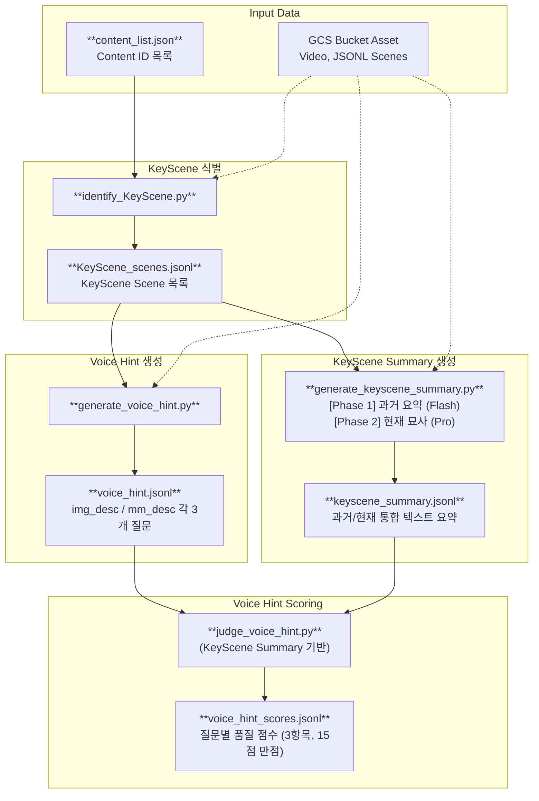
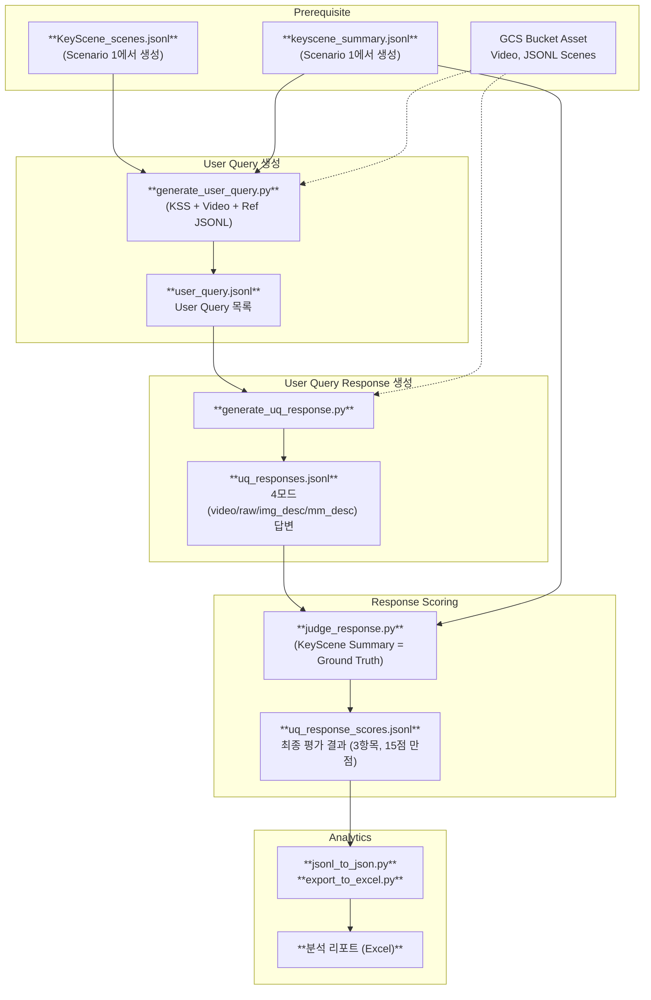

# LLMJudge (Multimodal Interactive Evaluation)

Google Cloud Storage(GCS)에 저장된 영상 및 메타데이터를 활용하여 **실시간 시청 상황을 모사한** 고도화된 질의응답 및 자동 평가 파이프라인(CLI)입니다.

## 📝 프로젝트 개요

이 프로젝트는 시청자가 영상을 중간까지 보다가 질문을 남길 만한 핵심 씬 (KeyScene Scene)을 식별하고, 해당 시점까지의 **과거 맥락(Past)** 과 **현재 장면(Current Focus)** 을 분리하여 분석합니다. 두 가지 유형의 질문을 생성하고, 각각에 적합한 평가 프로세스를 적용합니다.

- **Voice Hint**: 현재 장면에 보이는 것만으로 생성되는 시청자의 즉각적인 궁금증 (장면 중심)
  - KeyScene 식별 → Voice Hint 생성 → KeyScene Summary 기반 질문 품질 평가 (Scoring)
- **User Query**: 지금까지 누적해서 본 전체 맥락에서 자연스럽게 발생하는 종합적인 질문 (맥락 중심)
  - 식별된 KeyScene 재사용 → User Query 생성 → 4개 모드(video/raw/img_desc/mm_desc) 답변 생성 → KeyScene Summary 기반 답변 평가

## 🔄 파이프라인 흐름

### Scenario 1. Voice Hint Generation & Scoring



### Scenario 2. User Query Generation, Response Generation & Scoring



### 파이프라인 요약

| Step | 스크립트 | Source | Output | 모델 |
|------|----------|--------|--------|------|
| A-1 | `identify_keyscene.py` | Video + Ref JSONL | `KeyScene_scenes.jsonl` | Flash Lite |
| A-2 | `generate_keyscene_summary.py` | Video + Ref JSONL + 이전 KSS | `keyscene_summary.jsonl` | Flash Lite (Phase 1) + Pro (Phase 2) |
| A-3 | `generate_voice_hint.py` | img_desc / mm_desc JSONL | `voice_hint.jsonl` | Flash Lite |
| A-4 | `judge_voice_hint.py` | VH + KSS | `voice_hint_scores.jsonl` | Pro |
| B-1 | `generate_user_query.py` | KSS + Video + Ref JSONL | `user_query.jsonl` | Pro |
| B-2 | `generate_uq_response.py` | 4모드 JSONL + Video | `uq_responses.jsonl` | Flash Lite |
| B-3 | `judge_response.py` | Response + KSS | `uq_response_scores.jsonl` | Pro |
| B-4 | `jsonl_to_json.py` / `export_to_excel.py` | `uq_response_scores.jsonl` | Excel 리포트 | — |

## ✨ 핵심 설계 전략

### 1. KeyScene 식별: Scene 수에 따른 3경로 분기 전략

단일 영상을 하나의 모델 호출로 분석하면 씬 수가 많아질수록 컨텍스트가 과부하됩니다. 이를 해결하기 위해 전체 씬 수에 따라 LLM 호출 전략을 3가지로 분기합니다.

| Scene 수 | 경로 | Stage 1 | Stage 2 |
|----------|------|---------|---------|
| ≤ 8개 | A | LLM 호출 없이 전체를 KeyScene으로 자동 지정 | — |
| 9 ~ 17개 | B | 2등분 → 각 세그먼트에서 병렬로 4개씩 추출 | 생략 (단순 결합) |
| ≥ 18개 | C | 3등분 → 각 세그먼트에서 병렬로 Candidate 무제한 추출 | Selector 모델이 전체 Candidate 중 8개 최종 선별 |

Stage 1 Candidate 프롬프트는 `rationale` (2~3문장 상세 이유), `category` (전환점/새로운행동/시각적임팩트/호기심발언), `impact` (1~5 강도)를 포함한 구조화된 JSON을 요구합니다. Stage 2 Selector 프롬프트는 **impact 점수 + 시간적 균등 분포 + 카테고리 다양성 + 중복 제거** 기준을 명시적으로 지시하여 고품질의 균형 잡힌 KeyScene 집합을 보장합니다.

### 2. KeyScene Summary: 2-Phase 세션 아키텍처

각 KeyScene에 대해 "과거를 이해한 AI가 현재 장면을 정밀하게 묘사"하는 것이 목표입니다. 이를 위해 한 번의 거대한 멀티모달 호출 대신, **역할이 다른 두 세션으로 분리**하여 각각 최적의 모델을 배치합니다.

```
[과거 연대기 구축]
  ├─ 이전 KSS들의 description 텍스트 (시간순)
  └─ 각 KSS 사이 Gap 구간의 Ref 메타데이터 (Bridge 역할)
       ↓ (텍스트 only → 토큰 비용 최소화)
[Phase 1: 과거 장면 요약] → Flash Lite (thinking: medium)
  "지금까지 발생한 사건의 흐름을 하나의 상세한 과거 요약으로 작성"
       ↓
[Phase 2: 현재 장면 묘사] → Pro (thinking: high)
  입력: 과거 요약 텍스트 + 현재 Ref JSONL + 현재 비디오 (멀티모달)
  "과거 맥락을 파악한 뒤, 비디오와 메타데이터를 교차 검증하여 현재 장면을 상세 묘사"
```

- **Phase 1**은 텍스트만 처리하므로 경량 Flash Lite 모델로 충분하며 비용을 절약합니다.
- **Phase 2**는 비디오를 직접 보며 메타데이터 오류(ASR 오탈자, OCR 오류, 효과음 분류 오류)를 교정해야 하므로 Pro 모델 + 높은 Thinking Level을 배치합니다.
- 첫 번째 KeyScene 이전 구간(Scene 0 ~ 첫 KSS 이전)도 Gap으로 처리하여 **연대기의 완전성**을 보장합니다.
- 생성된 KSS는 이후 Voice Hint Judge, User Query Judge의 **Ground Truth**로 재활용됩니다.

### 3. Voice Hint 생성: 페이로드 설계와 프롬프팅 전략

Voice Hint는 "현재 장면을 보는 순간 자연스럽게 드는 궁금증"이므로, 비디오 대신 **description 텍스트만**을 입력으로 사용합니다. `img_desc`(시각 묘사)와 `mm_desc`(멀티모달 통합 묘사) 두 모드를 각각 독립적으로 병렬 처리합니다.

**LITM(Lost-In-The-Middle) 대응 샌드위치 구조:**

현재 장면 정보가 모델의 주의(Attention)에서 밀리지 않도록 페이로드를 다음 순서로 구성합니다.

```
[현재 장면] → [과거 맥락 (Sliding Window: 직전 N개 KP)] → [현재 장면 재확인] → [요청]
```

- 과거 맥락은 전체 JSONL이 아닌 **직전 N개 KeyScene의 description 필드만** 추출하여 토큰 볼륨을 최소화합니다. (기본 `vh_gen_past_scenes_size=3`)
- 요청 프롬프트에 "**[현재 장면]에서 발생한 사건이 직접적인 트리거여야 한다**"를 명시하여 과거 사건을 묻는 "뒷북 질문"을 방지합니다.

**VH 생성 프롬프트 (CX 전문가 페르소나) 핵심 전략:**

| 전략 | 내용 |
|------|------|
| **VLM 노이즈 교정** | 오탈자/환각을 일반 상식으로 교정 후 질문 기획 (최우선) |
| **정보 공백 타겟팅** | 과거 맥락에서 이미 알려진 사실은 절대 묻지 않음 |
| **플랫폼 확장성 유도** | 단순 Yes/No가 아닌, 관련 VOD·배경지식 탐색으로 이어지는 질문 우대 |
| **스포일러 금지** | 미래 전개를 암시하거나 예측하는 질문 절대 금지 |
| **구어체 강제** | 친구에게 툭 던지는 반말 캐주얼체 (TV 화면 노출 최적화) |

### 4. User Query 생성: KSS 기반 맥락 설계

User Query는 "그동안 본 전체 스토리를 알고 있는 시청자의 거시적 질문"이므로, Voice Hint와 달리 **KeyScene Summary 텍스트를 주요 맥락 소스**로 사용합니다. 여기에 현재 Ref JSONL + 현재 비디오를 추가하여 실제 시청 맥락을 강화합니다.

페이로드 구성:
```
[KeyScene Summary (누적 맥락 요약)] → [현재 Ref 메타데이터] → [현재 비디오] → [요청]
```

생성 프롬프트는 "어투: 인터넷 커뮤니티나 친구에게 물어보는 매우 캐주얼한 구어체"를 명시하며, 현재 장면에만 국한되지 않고 **누적된 이야기 흐름 또는 앞선 사건과의 연관성**에 관한 거시적 질문임을 강조합니다.

### 5. UQ Response 생성: 4모드 병렬 추론 및 Past/Current 분리

`video`, `raw`, `img_desc`, `mm_desc`의 4개 모달리티를 독립적으로 병렬 추론하여 **모달리티별 성능 격차를 공정하게 비교**합니다.

각 모드는 동일하게 scene_idx 기준으로 **Past / Current 구간을 분리**하여 제공합니다.

```
Past Information  : [Scene 0 ~ {scene_idx-1}]    ← 시청자의 누적 기억
Current Information: [Scene {scene_idx}]           ← 지금 보고 있는 장면
```

AI 시청 파트너 시스템 프롬프트는 두 가지 핵심을 강조합니다:
- **VLM 노이즈 스무딩**: 상충 정보(예: ASR의 'An Seo-jin' vs OCR의 '안성재')를 맥락과 상식으로 자동 교정
- **대화 이어가기**: 답변 후 "꼬리 질문" 하나를 반드시 던져 시청자의 몰입을 유지

### 6. 자동 평가(Judge): 평가 기준 체계

**Voice Hint Judge (15점 만점):**

| 항목 | 5점 기준 |
|------|---------|
| 호기심 및 상호작용 유도력 (Curiosity & Hook) | "나도 방금 저거 궁금했는데!"라는 공감과 함께 무조건 클릭하게 만드는 질문 |
| 시점 몰입도 (Temporal Immersion) | 현재 장면의 분위기를 깨지 않고 자연스럽게 스며드는 완벽한 타이밍 |
| 플랫폼 체류 확장성 (Platform Extensibility) | 관련 VOD·배경지식으로 이어져 스마트폰 이탈을 방어하는 확장성 높은 질문 |

**User Query Response Judge (15점 만점):**

| 항목 | 평가 내용 |
|------|---------|
| 정확성 (Accuracy) | KeyScene Summary와 사실이 일치하는가, 환각이 없는가 |
| 포괄성 (Completeness) | KSS의 핵심 단서를 누락 없이 포함했는가 |
| 가독성 (Helpfulness) | 자연스럽고 이해하기 쉬운가, 시스템 용어(JSON·타임스탬프 등) 미사용 |

두 Judge 모두 **KeyScene Summary를 유일한 Ground Truth**로 사용합니다. 별도의 Reference Answer 생성 단계 없이, Phase 2에서 Pro 모델이 실제 비디오를 보며 생성한 상세 묘사가 기준점 역할을 합니다.

### 7. Step별 모델 사용 전략

생성(Generation)은 Flash Lite로 비용을 최소화하고, 판단·평가(Judge/Analysis)는 Pro로 품질을 극대화하는 원칙을 따릅니다.

| 단계 | 역할 | 모델 | Thinking Level | 근거 |
|------|------|------|----------------|---------|
| A-1 | KeyScene 식별 | Flash Lite | medium | 대량 세그먼트 병렬 처리, 비용 최소화 |
| A-2 Phase 1 | 과거 요약 | Flash Lite | medium | 텍스트 only · 요약 작업 → 경량 충분 |
| A-2 Phase 2 | 현재 장면 묘사 | Pro | high | 멀티모달 + 오류 교정 + 정밀 묘사 |
| A-3 | Voice Hint 생성 | Flash Lite | low | desc 텍스트 only · 대량 병렬 생성 |
| A-4 | VH Judge | Pro | high | 비즈니스 가치 판단 · 미묘한 차이 평가 |
| B-1 | User Query 생성 | Pro | high | 멀티모달 · 복잡 맥락 종합 판단 |
| B-2 | UQ Response 생성 | Flash Lite | medium | 4모드 병렬 × 대량 처리, 비용 최소화 |
| B-3 | UQ Response Judge | Pro | high | Ground Truth 대비 정밀 평가 |

### 8. 메타데이터 모드 구조

영상으로부터 추출된 메타데이터는 목적에 따라 5종으로 관리됩니다:

| 모드 | 파일 | 용도 |
|------|------|------|
| `video` | `*_540p.mp4` | 시각 원본 모달리티 평가 |
| `raw` | `*_raw.jsonl` | ASR(음성 인식) + OCR(자막) 원시 데이터 |
| `img_desc` | `*_imgdesc.jsonl` | VLM이 이미지 프레임만 보고 생성한 시각 묘사 |
| `mm_desc` | `*_mmdesc.jsonl` | VLM이 영상·음성·자막을 종합하여 생성한 묘사 |
| `ref` | `*_ref.jsonl` | KeyScene 식별·KSS 생성용 정밀 기준 메타데이터 |

`ref` 모드 사용 프롬프트에는 **"메타데이터는 보조 참고 자료이며 비디오 프레임의 시각 정보를 우선 참고"** 주의사항을 내장하여 메타데이터 오류에 의한 환각을 방지합니다.

## 🗂 파일 구조

```text
LLMJudge/
├── main.py                       # E2E 파이프라인 오케스트레이터
├── identify_KeyScene.py          # KeyScene Scene 식별 (A-1)
├── generate_keyscene_summary.py  # KeyScene 입력 → KeyScene Summary 생성 (A-2)
├── generate_voice_hint.py        # KeyScene 입력 → Voice Hint 생성 (A-3)
├── judge_voice_hint.py           # Voice Hint 및 Summary 기반 품질 평가 (A-4)
├── generate_user_query.py        # KeyScene + KSS → User Query 생성 (B-1)
├── generate_uq_response.py       # User Query → 4모드 병렬 답변 생성 (B-2)
├── judge_response.py             # 각 모드 답변에 대한 자동 품질 평가 (B-3)
├── utils.py                     # Gemini SDK, GCS 접근, 공통 유틸
├── jsonl_to_json.py              # JSONL → 분석용 JSON 변환
├── aggregate_scores.py           # 점수 집계
├── export_to_excel.py            # Excel 리포트 생성
├── config.json                   # 환경 설정 (GCP, 모델명 등)
├── content_list.json             # 평가 대상 Content ID 목록
└── assets/                       # 파이프라인 중간 결과 및 최종 스코어
    ├── KeyScene_scenes.jsonl
    ├── keyscene_summary.jsonl
    ├── voice_hint.jsonl
    ├── voice_hint_scores.jsonl
    ├── user_query.jsonl
    ├── uq_responses.jsonl
    └── uq_response_scores.jsonl
```

## 🚀 설치 및 사전 준비

1. **Python 패키지 설치**
   ```bash
   pip install google-cloud-aiplatform google-cloud-storage vertexai pandas openpyxl
   ```
   ```bash
   pip install --upgrade google-cloud-aiplatform google-cloud-storage
   ```

2. **GCP 인증 및 설정**
   ```bash
   gcloud auth application-default login
   ```
   `config.json`에 GCP 프로젝트 ID와 GCS 버킷 이름을 설정하세요.

3. **GCS 데이터 구조**
   ```text
   gs://{bucket}/video_540p/{content_id}_540p.mp4
   gs://{bucket}/jsonl/{content_id}_raw.jsonl
   gs://{bucket}/jsonl/{content_id}_imgdesc.jsonl
   gs://{bucket}/jsonl/{content_id}_mmdesc.jsonl
   gs://{bucket}/jsonl/{content_id}_ref.jsonl
   ```

4. **`config.json` 주요 설정 키**
   ```json
   {
     "gcp_project_id": "...",
     "gs_bucket_name": "...",
     "KeyScene_model": "gemini-3.1-flash-lite-preview",
     "KeyScene_thinking_level": "low",
     "kss_past_summary_model": "gemini-3.1-flash-lite-preview",
     "kss_past_summary_thinking_level": "medium",
     "kss_current_scene_model": "gemini-3.1-pro-preview",
     "kss_current_scene_thinking_level": "high",
     "use_ref_for_keyscene_summary": true,
     "vh_gen_model": "gemini-3.1-flash-lite-preview",
     "vh_thinking_level": "low",
     "vh_gen_past_scenes_size": 3,
     "vh_judge_model": "gemini-3.1-pro-preview",
     "vh_judge_thinking_level": "high",
     "uq_gen_model": "gemini-3.1-pro-preview",
     "uq_gen_thinking_level": "high",
     "uq_response_model": "gemini-3.1-flash-lite-preview",
     "uq_response_thinking_level": "medium",
     "uq_judge_model": "gemini-3.1-pro-preview",
     "uq_judge_thinking_level": "high"
   }
   ```

## 🎯 실행 방법

### 각 모듈 개별 실행
```bash
# A-1: KeyScene 식별
python identify_keyscene.py

# A-2: KeyScene Summary 생성
python generate_keyscene_summary.py

# A-3: Voice Hint 생성 (KeyScene 입력)
python generate_voice_hint.py

# A-4: Voice Hint 품질 Judge
python judge_voice_hint.py

# B-1: User Query 생성 (KeyScene + KSS 입력)
python generate_user_query.py

# B-2: User Query 답변 생성 (실시간 모니터링 모드 가능)
python generate_uq_response.py --continuous

# B-3: 답변 Judge (실시간 모니터링 모드 가능)
python judge_response.py --continuous
```

### 통합 실행
```bash
# 전체 파이프라인 실행
python main.py --input_file content_list.json
```

## 📊 출력 데이터 상세 예시 (assets/)

### 1. `voice_hint.jsonl` (Voice Hint 생성 결과)
```json
{
  "content_id": "v001",
  "scene_idx": 5,
  "start_time": 120.0,
  "end_time": 135.2,
  "queries": [
    {
      "mode": "img_desc",
      "queries": ["방금 저 사람이 들고 있던 게 뭐야?", "..."],
      "rationale": "묘사의 '봄고레' 오탈자를 '범고래'로 교정함. 과거에 혹등고래가 먹이를 찾지 못하던 장면을 알고 있는 시청자 입장에서..."
    },
    {
      "mode": "mm_desc",
      "queries": ["저 소리, 사냥 시작한다는 신호 아니야?", "..."],
      "rationale": "..."
    }
  ]
}
```

### 2. `keyscene_summary.jsonl` (KeyScene Summary)
```json
{
  "content_id": "v001",
  "scene_idx": 5,
  "start_time": 120.0,
  "end_time": 135.2,
  "summary": "[1. 과거 장면 요약]\n\n...(이전 사건 흐름)...\n\n[2. 현재 장면 묘사]\n\n...(현재 장면 상세 묘사)..."
}
```

### 3. `uq_responses.jsonl` (User Query 답변 생성 결과)
```json
{
  "content_id": "v001",
  "query": "앞에서 나왔던 사건이 지금이랑 연관 있는 거야?",
  "scene_idx": 5,
  "answers": { "video": "...", "raw": "...", "img_desc": "...", "mm_desc": "..." }
}
```

### 4. `uq_response_scores.jsonl` (최종 평가 결과)
```json
{
  "content_id": "v001",
  "query": "앞에서 나왔던 사건이 지금이랑 연관 있는 거야?",
  "judge": {
    "video": {
      "rationale": "답변이 Reference의 핵심을 잘 포착했으나 구체적인 장면 묘사가 부족함.",
      "scores": { "accuracy": 4, "completeness": 3, "helpfulness": 4 },
      "total_score": 11
    },
    "img_desc": { "...": "..." }
  }
}
```

## 📈 분석 결과 확인

파이프라인 완료 후 `results/` 디렉토리에서 시각화된 분석 결과를 확인할 수 있습니다.

```bash
python jsonl_to_json.py    # JSONL → JSON 변환
python aggregate_scores.py # 점수 집계
python export_to_excel.py  # Excel 리포트 생성
```

| 파일 | 내용 |
|------|------|
| `results/uq_details.xlsx` | 질문별·모드별 상세 점수, 답변, Summary 비교 |
| `results/uq_scores.xlsx` | 모드별 평균 점수 종합 요약 |
| `results/vh_scores.xlsx` | Voice Hint 질문별 품질 점수 |

**UQ 평가 기준**: 정확성(Accuracy) · 포괄성(Completeness) · 가독성(Helpfulness) — 각 1~5점, 총 15점 만점.  
**VH 평가 기준**: 호기심 유도력 · 시점 몰입도 · 플랫폼 체류 확장성 — 각 1~5점, 총 15점 만점.
