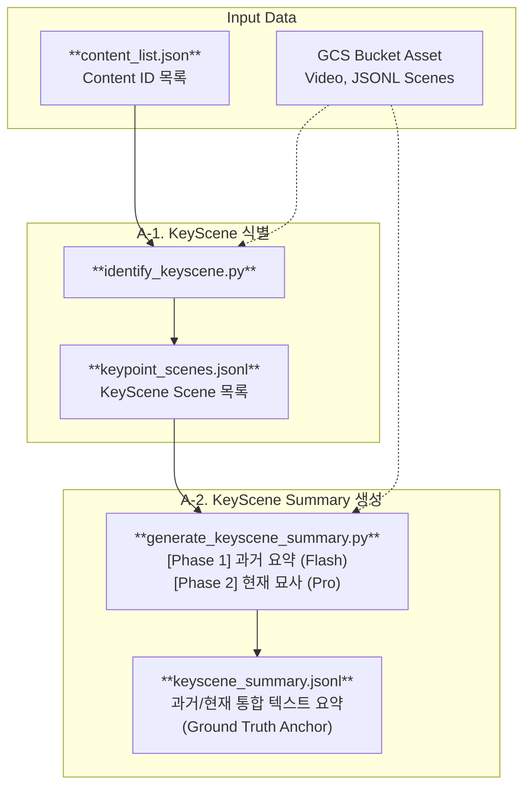
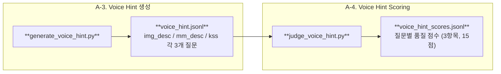
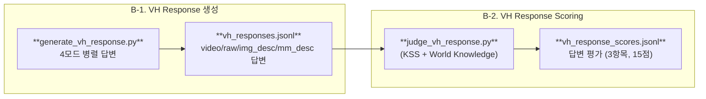
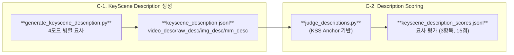

# LLMJudge (Multimodal Interactive Evaluation)

Google Cloud Storage(GCS)에 저장된 영상 및 메타데이터를 활용하여 **실시간 시청 상황을 모사한** 고도화된 질의응답 및 자동 평가 파이프라인(CLI)입니다.

## 📝 프로젝트 개요

이 프로젝트는 시청자가 영상을 중간까지 보다가 질문을 남길 만한 핵심 씬 (KeyScene)을 식별하고, 해당 시점까지의 **과거 맥락(Past)** 과 **현재 장면(Current Focus)** 을 분리하여 분석합니다. 3가지 트랙(A/B/C)으로 나뉜 평가 파이프라인을 통해, 각각의 입력 모달리티가 얼마나 정확하고 유용한 출력을 생성하는지 공정하게 비교합니다.

### 3-Track 파이프라인

- **A-Track (Voice Hint)**: 현재 장면에 보이는 것만으로 생성되는 시청자의 즉각적인 궁금증 → 질문 품질 평가
- **B-Track (VH Response)**: Voice Hint 질문에 4개 모달리티로 응답 생성 → KSS + World Knowledge 기반 답변 평가
- **C-Track (KeyScene Description)**: 4개 모달리티로 장면 묘사 생성 → KSS Anchor 기반 묘사 정확도 평가

## 🔄 파이프라인 흐름

### 공통 인프라 (A-1, A-2)



### A-Track: Voice Hint Generation & Scoring



### B-Track: VH Response Generation & Scoring



### C-Track: KeyScene Description Generation & Scoring



### 파이프라인 요약

| Step | 스크립트 | Source | Output | 모델 |
|------|----------|--------|--------|------|
| A-1 | `identify_keyscene.py` | Video + Ref JSONL | `keypoint_scenes.jsonl` | Flash Lite |
| A-2 | `generate_keyscene_summary.py` | Video + Ref JSONL + 이전 KSS | `keyscene_summary.jsonl` | Flash Lite → Pro |
| A-3 | `generate_voice_hint.py` | img_desc / mm_desc / kss JSONL | `voice_hint.jsonl` | Flash Lite |
| A-4 | `judge_voice_hint.py` | VH + KSS | `voice_hint_scores.jsonl` | Pro |
| B-1 | `generate_vh_response.py` | 4모드 JSONL + Video | `vh_responses.jsonl` | Flash Lite |
| B-2 | `judge_vh_response.py` | Response + KSS | `vh_response_scores.jsonl` | Pro |
| C-1 | `generate_keyscene_description.py` | 4모드 JSONL + Video | `keyscene_description.jsonl` | Flash Lite |
| C-2 | `judge_descriptions.py` | Description + KSS | `keyscene_description_scores.jsonl` | Pro |
| — | `export_to_excel.py` | 모든 scores JSONL | Excel 리포트 | — |

## ✨ 핵심 설계 전략

### 1. KeyScene 식별: Scene 수에 따른 3경로 분기 전략

단일 영상을 하나의 모델 호출로 분석하면 씬 수가 많아질수록 컨텍스트가 과부하됩니다. 이를 해결하기 위해 전체 씬 수에 따라 LLM 호출 전략을 3가지로 분기합니다.

| Scene 수 | 경로 | Stage 1 | Stage 2 |
|----------|------|---------|---------|
| ≤ 8개 | A | LLM 호출 없이 전체를 KeyScene으로 자동 지정 | — |
| 9 ~ 17개 | B | 2등분 → 각 세그먼트에서 병렬로 4개씩 추출 | 생략 (단순 결합) |
| ≥ 18개 | C | 3등분 → 각 세그먼트에서 병렬로 Candidate 무제한 추출 | Selector 모델이 전체 Candidate 중 8개 최종 선별 |

### 2. KeyScene Summary: 2-Phase 세션 아키텍처

각 KeyScene에 대해 "과거를 이해한 AI가 현재 장면을 정밀하게 묘사"하는 것이 목표입니다. 역할이 다른 두 세션으로 분리하여 각각 최적의 모델을 배치합니다.

```
[Phase 1: 과거 장면 요약] → Flash Lite (thinking: medium)
  입력: 이전 KSS + Gap 구간 Ref 메타데이터 (텍스트 only)
  "지금까지 발생한 사건의 흐름을 하나의 상세한 과거 요약으로 작성"
       ↓
[Phase 2: 현재 장면 묘사] → Pro (thinking: high)
  입력: 과거 요약 + 현재 Ref JSONL + 현재 비디오 (멀티모달)
  "과거 맥락을 파악한 뒤, 비디오와 메타데이터를 교차 검증하여 현재 장면을 상세 묘사"
```

생성된 KSS는 이후 모든 Judge 파이프라인의 **Ground Truth Anchor**로 재활용됩니다.

### 3. 4-Mode 병렬 처리 아키텍처

B-Track과 C-Track은 동일한 4개 모달리티를 독립적으로 병렬 처리하여 **모달리티별 성능 격차를 공정하게 비교**합니다.

| 모드 | 파일 | 설명 |
|------|------|------|
| `video` / `video_desc` | `*_540p.mp4` | 시각 원본 모달리티 |
| `raw` / `raw_desc` | `*_raw.jsonl` | ASR(음성 인식) + OCR(자막) 원시 데이터 |
| `img_desc` | `*_imgdesc.jsonl` | VLM이 이미지 프레임만 보고 생성한 시각 묘사 |
| `mm_desc` | `*_mmdesc.jsonl` | VLM이 영상·음성·자막을 종합하여 생성한 묘사 |

정규 순서: `video_desc → raw_desc → img_desc → mm_desc` (JSONL 쓰기 및 콘솔 출력 모두 적용)

### 4. Watch 모드: 파이프라인 병렬 실행

Generation과 Judging 스크립트를 **별도 터미널에서 동시 실행**할 수 있습니다. Judge 스크립트는 `--watch` 플래그로 입력 파일을 `seek` 기반으로 증분 모니터링하며, `pipeline_done` 시그널을 감지하면 자동 종료됩니다.

```bash
# 터미널 1: 생성
python generate_keyscene_description.py

# 터미널 2: 실시간 Judge (파일이 채워지는 대로 평가)
python judge_descriptions.py --watch
```

### 5. 자동 평가(Judge): 3-Criteria 통합 루브릭

모든 Judge는 **영문, 기준별 개별 rationale, flat JSON 구조, 15점 만점** 으로 통일됩니다.

#### C-Track: Description Judge

| 기준 | 평가 대상 |
|------|----------|
| **Scene Understanding** | 시각 요소 (구도, 인물, 행동, 환경) 정확도 |
| **Factual Precision** | 고유명사, 대사, 수치 등 검증 가능한 사실 일치 |
| **Narrative Completeness** | 서사 흐름, 인과관계, 감정적 톤 완성도 |

- Fabrication > Omission 패널티
- World Knowledge로 정확하게 식별한 경우 (예: 유명인 인식) 긍정 평가

#### B-Track: VH Response Judge

| 기준 | 평가 대상 |
|------|----------|
| **Answer Relevance** | 질문에 직접적·실질적으로 답변하는가 |
| **Factual Precision** | 영상 사실 + 외부 지식 모두의 정확도 |
| **Response Quality** | 자연스러움, 구조, 시스템 용어 미노출 |

- **World Knowledge 장려**: KSS에 없더라도 정확한 보충 지식은 감점하지 않음
- **영상 모순 > 외부 오류**: 영상 내용과 모순되는 정보는 외부 지식 오류보다 더 크게 감점

#### A-Track: Voice Hint Judge

| 기준 | 평가 대상 |
|------|----------|
| **호기심 및 상호작용 유도력** | "나도 방금 저거 궁금했는데!" 공감형 질문 |
| **시점 몰입도** | 현재 장면의 분위기를 깨지 않는 타이밍 |
| **플랫폼 체류 확장성** | 관련 VOD·배경지식으로 이어지는 확장성 |

### 6. Step별 모델 사용 전략

생성(Generation)은 Flash Lite로 비용을 최소화하고, 판단·평가(Judge/Analysis)는 Pro로 품질을 극대화합니다.

| 단계 | 역할 | 모델 | Thinking Level |
|------|------|------|----------------|
| A-1 | KeyScene 식별 | Flash Lite | medium |
| A-2 Phase 1 | 과거 요약 | Flash Lite | medium |
| A-2 Phase 2 | 현재 장면 묘사 | Pro | high |
| A-3 | Voice Hint 생성 | Flash Lite | low |
| A-4 | VH Judge | Pro | high |
| B-1 | VH Response 생성 | Flash Lite | low |
| B-2 | VH Response Judge | Pro | high |
| C-1 | KeyScene Description 생성 | Flash Lite | low |
| C-2 | Description Judge | Pro | high |

## 🗂 파일 구조

```text
LLMJudge/
├── main.py                          # E2E 파이프라인 오케스트레이터
├── identify_keyscene.py             # KeyScene Scene 식별 (A-1)
├── generate_keyscene_summary.py     # KeyScene Summary 생성 (A-2)
├── generate_voice_hint.py           # Voice Hint 생성 (A-3)
├── judge_voice_hint.py              # Voice Hint 품질 Judge (A-4)
├── generate_vh_response.py          # VH Response 4모드 병렬 생성 (B-1)
├── judge_vh_response.py             # VH Response Judge (B-2)
├── generate_keyscene_description.py # KeyScene Description 4모드 생성 (C-1)
├── judge_descriptions.py            # Description Judge (C-2)
├── utils.py                         # Gemini SDK, GCS 접근, 공통 유틸
├── export_to_excel.py               # Excel 리포트 생성
├── clean_vh_desc.py                 # JSONL 내 특정 모드 삭제 유틸
├── config.json                      # 환경 설정 (GCP, 모델명 등)
├── content_list.json                # 평가 대상 Content ID 목록
└── assets/                          # 파이프라인 중간 결과 및 최종 스코어
    ├── keypoint_scenes.jsonl
    ├── keyscene_summary.jsonl
    ├── voice_hint.jsonl
    ├── voice_hint_scores.jsonl
    ├── vh_responses.jsonl
    ├── vh_response_scores.jsonl
    ├── keyscene_description.jsonl
    └── keyscene_description_scores.jsonl
```

## 🚀 설치 및 사전 준비

1. **Python 패키지 설치**
   ```bash
   pip install google-genai google-cloud-storage pandas openpyxl
   ```

2. **GCP 인증 및 설정**
   ```bash
   gcloud auth application-default login
   ```
   `config.json`에 GCP 프로젝트 ID와 GCS 버킷 이름을 설정하세요.

3. **GCS 데이터 구조**
   ```text
   gs://{bucket}/video_540p/{content_id}_540p.mp4
   gs://{bucket}/jsonl/{content_id}_raw.jsonl
   gs://{bucket}/jsonl/{content_id}_imgdesc.jsonl
   gs://{bucket}/jsonl/{content_id}_mmdesc.jsonl
   gs://{bucket}/jsonl/{content_id}_ref.jsonl
   ```

4. **`config.json` 주요 설정 키** (sample_config.json 참고)
```json
{
    "gcp_project_id": "insight-dev-490002",
    "gs_bucket_name": "insight-youtubevideodataset",
    "location": "global",
    "keypoint_model": "gemini-3.1-flash-lite-preview",
    "keypoint_thinking_level": "medium",
    "kss_past_summary_model": "gemini-3.1-pro-preview",
    "kss_past_summary_thinking_level": "high",
    "kss_current_scene_model": "gemini-3.1-pro-preview",
    "kss_current_scene_thinking_level": "high",
    "use_ref_for_keyscene_summary": true,
    "vh_gen_model": "gemini-3.1-flash-lite-preview",
    "vh_gen_past_scenes_size": 5,
    "vh_thinking_level": "medium",
    "vh_response_model": "gemini-3.1-flash-lite-preview",
    "vh_response_thinking_level": "medium",
    "vh_response_judge_model": "gemini-3.1-pro-preview",
    "vh_response_judge_thinking_level": "high",
    "ksd_gen_model": "gemini-3.1-flash-lite-preview",
    "ksd_gen_thinking_level": "low",
    "ksd_judge_model": "gemini-3.1-pro-preview",
    "ksd_judge_thinking_level": "high"
}
```

## 🎯 실행 방법

### A-Track (Voice Hint)
```bash
python identify_keyscene.py                       # A-1: KeyScene 식별
python generate_keyscene_summary.py               # A-2: KeyScene Summary 생성
python generate_voice_hint.py                     # A-3: Voice Hint 생성
python judge_voice_hint.py                        # A-4: Voice Hint 품질 Judge
```

### B-Track (VH Response)
```bash
python generate_vh_response.py                    # B-1: 4모드 Response 생성
python judge_vh_response.py                       # B-2: Response Judge

# 또는 Watch 모드로 병렬 실행:
python generate_vh_response.py &                  # 터미널 1
python judge_vh_response.py --watch               # 터미널 2
```

### C-Track (KeyScene Description)
```bash
python generate_keyscene_description.py           # C-1: 4모드 Description 생성
python judge_descriptions.py                      # C-2: Description Judge

# 또는 Watch 모드로 병렬 실행:
python generate_keyscene_description.py &         # 터미널 1
python judge_descriptions.py --watch              # 터미널 2
```

### 통합 실행 (A+B Track)
```bash
python main.py --input_file content_list.json
```

### Analytics
```bash
python export_to_excel.py                         # Excel 리포트 생성
```

## 📊 출력 데이터 예시 (assets/)

### `keyscene_description_scores.jsonl` (C-Track 평가 결과)
```json
{
  "content_id": "001_NatGeoKR_Narwhal_6m",
  "scene_idx": 1,
  "mode": "video_desc",
  "total_score": 14,
  "judge": {
    "scene_understanding": {
      "rationale": "Captures the arctic setting with narwhals surfacing...",
      "score": 4
    },
    "factual_precision": {
      "rationale": "All key names and facts match the Anchor...",
      "score": 5
    },
    "narrative_completeness": {
      "rationale": "Successfully conveys the narrative arc...",
      "score": 5
    }
  }
}
```

### `vh_response_scores.jsonl` (B-Track 평가 결과)
```json
{
  "content_id": "001_NatGeoKR_Narwhal_6m",
  "query": "외뿔고래 이빨이 왜 저렇게 생긴 거야?",
  "judge": {
    "video": {
      "answer_relevance": { "rationale": "Directly addresses...", "score": 5 },
      "factual_precision": { "rationale": "Accurate facts...", "score": 4 },
      "response_quality": { "rationale": "Well-structured...", "score": 5 }
    },
    "raw": { "...": "..." },
    "img_desc": { "...": "..." },
    "mm_desc": { "...": "..." }
  }
}
```

## 📈 콘솔 출력 예시

### Judge 로그 (Scene 단위 그룹화)
```
============================================================
[Judge] '001_NatGeoKR_Narwhal_6m' | Scene 1
============================================================

[video_desc] Total: 14/15 | Scene Understanding=4 | Factual Precision=5 | Narrative Completeness=5
- Scene Understanding (4/5): Captures the arctic setting...
- Factual Precision (5/5): All key names match...
- Narrative Completeness (5/5): Full narrative arc covered...

[raw_desc] Total: 11/15 | Scene Understanding=2 | Factual Precision=5 | Narrative Completeness=4
- Scene Understanding (2/5): Limited visual detail...
...

[img_desc] Total: 6/15 | ...

[mm_desc] Total: 11/15 | ...

▶ [Judge] 누적 평가 완료: 4개
```
