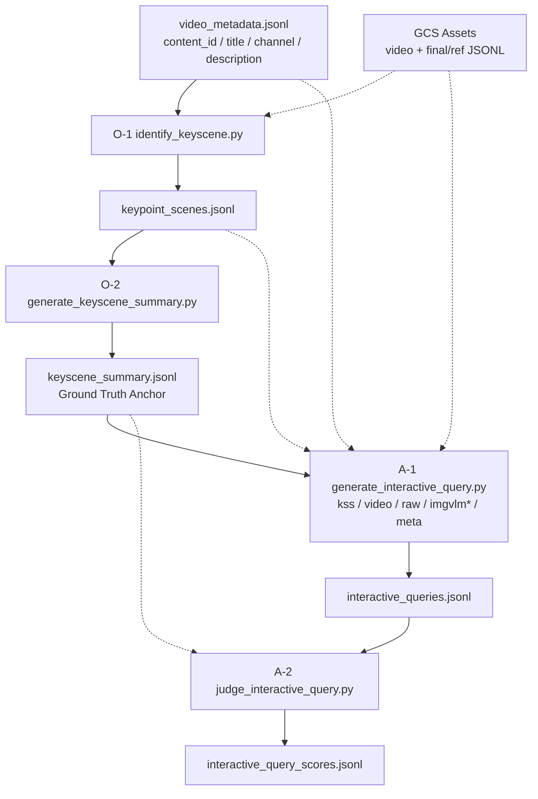

# LLMJudge (Multimodal Interactive Evaluation)

Google Cloud Storage(GCS)에 저장된 영상 및 메타데이터를 활용하여 **멀티모달 대화 시나리오 품질을** 자동으로 생성하고 평가 할 수 있는 자동화 파이프라인(CLI)입니다.

## 핵심 아키텍처 개요

이 파이프라인은 동영상의 시간적 구조를 기반으로 핵심 장면 구간 별 주요 전환 점(KeyScene)을 식별하고, 각각의 장면에서 **과거 맥락(Past)** 과 **현재 초점(Current Focus)** 을 결합하여 분석합니다. 현재 활성 파이프라인은 **A-Track (Interactive Query)** 중심이며, 과거의 B-Track(Interactive Query Response)은 실험 종료 후 `archived/`로 이동되었습니다.

### Track 상태

- **A-Track (Interactive Query)**: 시청자 유도용 질문을 생성하고 평가하는 트랙으로, 소스 데이터의 수준에 따라 두 개의 트랙으로 명확히 구분 및 정렬됩니다.
  - **High-Context 트랙** (`kss`, `video`, `raw`, `raw_with_mmvlm` 모드): 현재 및 과거의 풍부한 맥락을 바탕으로 화면 속 주요 인물·사건·주제에 직접 연결된 깊이 있는 **콘텐츠 특화 질문 (Content-Anchored)** 2개를 생성하고 평가합니다.
  - **Low-Context 트랙** (`imgvlm_sentence`, `imgvlm_chunk2`, `imgvlm_graph` 모드): 비식별화 처리된 시각 메타데이터만을 바탕으로 화면 속 지형·사물·소품 등에서 파생된 외부 상식과 호기심을 자극하는 **곁다리 지식 질문 (Tangential Knowledge)** 2개를 생성하고 평가합니다. 과거 장면 정보(비식별 VLM 형태)도 함께 인지하여 시청 흐름을 이해하되, 이전 장면에 이미 밝혀진 사실을 중복 질문하는 것을 방지하는 **"과거 뒷북 금지"** 제약이 적용됩니다.
- **~~B-Track (Interactive Query Response)~~** (Deprecated): A-Track의 `kss` 모드로 생성된 고품질의 질문(Query)들을 **공통 Query**로 일치시켜 던지고 각 데이터소스별로 답변을 생성하여 비교하는 **통제 변인 실험** 트랙(기본값, `--query_source kss`) 또는 각 모드별로 생성된 자체 Interactive Query를 질문으로 사용하는 트랙(옵션, `--query_source sourcewise`)입니다. 답변을 KSS 및 World Knowledge 기준으로 채점하며, `blank` 모드는 어떠한 메타데이터(예: 채널/작품명 등의 Video Context)나 비디오/텍스트 정보도 제공받지 않고 오로지 사전에 학습된 세계 지식(World Knowledge)만으로 답변하는 제로-메타데이터(Zero Metadata) 베이스라인 역할을 합니다. (단, `blank` 모드는 자체 Interactive Query가 존재하지 않으므로 `sourcewise` 옵션에서는 생성이 제외됩니다.)

#### A-Track 모드 (Interactive Query 생성)

| 트랙 구분                                        | Mode                | 데이터 소스                            | 설명                                                                                                                                                          |
| :----------------------------------------------- | :------------------ | :------------------------------------- | :------------------------------------------------------------------------------------------------------------------------------------------------------------ |
| **High-Context**`<br>`(콘텐츠 특화 질문) | `kss`             | KeyScene Summary (Ground Truth)        | 비디오+메타데이터를 종합 분석하여 생성한 고품질 요약. 다른 모드의**평가 기준(Anchor)** 역할                                                             |
|                                                  | `video`           | 원본 비디오 클립                       | 540p 비디오를 직접 Gemini에 전달하여 시각·청각 정보를 종합 분석                                                                                              |
|                                                  | `raw`             | ASR + OCR (원본 텍스트)                | Scene별 음성 인식(speech) + 화면 텍스트(on_screen_text)만 사용.**저작권 계약 필요**                                                                     |
|                                                  | `raw_with_mmvlm`  | ASR + OCR + VLM 멀티모달 서술          | `raw`에 소형 VLM의 시각·음성 종합 서술(vlm_mm_description)을 보조 참고로 추가. **저작권 계약 필요**                                                  |
| **Low-Context**`<br>`(곁다리 지식 질문)  | `imgvlm_chunk2`   | VLM 시각 구조화 데이터 (2어절 단편)    | 시각 프레임에서 추출한 Subjects/Contexts를 2어절 단위로 단편화·셔플·마스킹한 저작권 안전 형태. 과거 맥락 정보(과거 chunk2)도 제공되어 시청 흐름 유추에 활용 |
|                                                  | `imgvlm_sentence` | VLM 시각 구조화 데이터 (문장형)        | 시각 프레임에서 추출한 Subjects/Contexts를 비식별화된 문장 형태로 구성한 데이터. 과거 맥락 정보(과거 sentence)도 함께 제공됨                                  |
|                                                  | `imgvlm_graph`    | VLM 장면 지식 그래프                   | 시각 프레임에서 추출한 (subject)-[relation]->(object) 트리플로 장면 관계를 압축 표현. 과거 맥락 정보(과거 graph 트리플)도 제공됨                              |
|                                                  | `meta`            | 영상 기본 메타데이터 (채널명, 제목 등) | 동영상 내용(비디오/자막/VLM)을 보지 않고, 영상의 채널명/제목/설명 등 메타데이터만 활용해 곁다리 지식 질문 생성                                                |

#### ~~B-Track 모드 (Interactive Query Response 생성)~~ (Deprecated)

> B-Track은 현 파이프라인에서 제외되었습니다. 관련 스크립트는 `archived/`에 보관되어 있습니다.

---

## 저작권 안전한 데이터 구조 (Copyright-Safe Architecture)

이 파이프라인은 외부 모델 호출 시 원본의 **직접 재현이 불가능한 형태로 변환**합니다. 원저작 LLM이 생성한 설명문을 그대로 전송할 경우 저작물의 표현을 침해할 가능성이 있으므로, 구조화와 단편화 처리를 거쳐 전송 위험을 최소화합니다.

### 저작권 안전 처리 흐름: VLM 구조화 + 단편화 + 마스킹 (imgvlm)

`imgvlm` 모드는 온디바이스 VLM이 추출한 시각 메타데이터에 다단계 변환을 **비가역적으로 적용하여**, 원본 서술문/문장을 복원할 수 없는 형태로 가공합니다. 3단계 처리 프로세스는 다음과 같습니다:

1. **구조화 (Structuring)**: VLM 추출 원문을 의미 단위로 Subjects / Actions / Contexts 3개 카테고리로 분류
2. **2워드 단편화 (Bigram Fragmentation)**: 각 항목을 무작위로 2워드 단위로 잘라 내 원문 순서와의 대응을 완전히 제거. 파편 끝 잔류 구두점(`;` `.` `,`)은 자동 정제되며, 파편 간 구분자는 `' | '`를 사용
3. **고유명사 마스킹**: 작품명, 캐릭터명, 지명 등 식별자를 `[MASKED]` 토큰으로 대체

```
VLM 원문:  "A narwhal swims gracefully through the Arctic waters near ice floes"

구조화 + 단편화 후 (구분자: ' | '):
  Subjects: near ice | A narwhal                          (셔플됨)
  Actions:  gracefully through | swims [MASKED]           (단편화 + 마스킹)
  Contexts: ice floes | the Arctic | waters near          (셔플됨)
```

## 전체 파이프라인 구성



### 파이프라인 요약

| Step     | 스크립트                         | Output                            | 모델 (기본값)                   |
| -------- | -------------------------------- | --------------------------------- | ------------------------------- |
| O-1      | `identify_keyscene.py`         | `keypoint_scenes.jsonl`         | `gemini-3.1-flash-lite`       |
| O-2      | `generate_keyscene_summary.py` | `keyscene_summary.jsonl`        | `gemini-3.5-flash`            |
| A-1      | `generate_interactive_query.py`       | `interactive_queries.jsonl`              | `gemini-3.5-flash`            |
| A-2      | `judge_interactive_query.py`          | `interactive_query_scores.jsonl`       | `gemini-3.1-pro-preview`      |
| ~~B-1~~ | ~~`generate_interactive_query_response.py`~~ | ~~`interactive_query_responses.jsonl`~~       | ~~`gemini-3.1-flash-lite`~~  |
| ~~B-2~~ | ~~`judge_interactive_query_response.py`~~    | ~~`interactive_query_response_scores.jsonl`~~ | ~~`gemini-3.1-pro-preview`~~ |
| -        | `export_to_excel.py`           | Excel 리포트                      | -                               |

---

## 핵심 설계 기술 상세

### 1. KeyScene 식별: Scene 규모별 적응형 분할 전략

| Scene 수  | 구분 | 분할 및 선별 전략                                                                                     |
| --------- | ---- | ----------------------------------------------------------------------------------------------------- |
| ≤ 16개   | A    | LLM 판단 없이 전체 Scene을 KeyScene으로 그대로 사용                                                   |
| 17개 이상 | B    | 4등분 → 각 세그먼트에서 최대 6개 후보 추출 → 중복 제거 후 impact 상위 16개를 최종 KeyScene으로 선별 |

### 2. KeyScene Summary: 2-Phase 순차 생성전략

```
[Phase 1: 과거 맥락 요약] → Pro (thinking: high)
  입력: 기존 KSS + Gap 구간 Ref 메타데이터 (텍스트 only)
       ↓
[Phase 2: 현재 장면 생성] → Pro (thinking: high)
  입력: 과거 요약 + 현재 Ref JSONL + 현재 비디오클립 (멀티모달)
```

생성된 KSS는 이후 모든 Judge 스크립트에서 **Ground Truth Anchor**로 참조됩니다.

### 3. Interactive Query 생성 및 평가 철학: 이원화 트랙 전략 (Content-Anchored & Tangential Knowledge)

Interactive Query 파이프라인(A-Track)은 시청자가 스마트 TV 리모컨을 눌러 능동적으로 상호작용하도록 유도하기 위해 소스 데이터의 수준(풍부함)에 따라 질문 전략을 이원화하여 사용합니다.

#### 1) High-Context 트랙: 콘텐츠 특화 질문 (Content-Anchored)

풍부한 정보(동영상, GT 요약, 자막)에 접근 가능한 모드(`kss`, `video`, `raw`, `raw_with_mmvlm`)는 현재 장면의 **핵심 사건·인물·주제에 직접 연결된** 질문을 생성합니다.
단순한 1차원적 상황 묘사를 넘어 갈등 맥락, 인물의 심리적 배경, 전술 포인트, 이해관계 구도 등을 한 단계 깊이 파고들어 콘텐츠에 대한 몰입을 유도합니다.

#### 2) Low-Context 트랙: 곁다리 지식 질문 (Tangential Knowledge)

보호 조치(단편화, 그래프)로 인해 핵심 맥락 유추에 제약이 있는 모드(`imgvlm_sentence`, `imgvlm_chunk2`, `imgvlm_graph`)는 현재 장면 속 시각적 단서(소품, 배경, 의상 등)로부터 파생되는 **외부 확장 상식 및 곁다리 지식**을 질문합니다.
과거 맥락 데이터를 비식별화 형태로 제공받아 스토리의 진행 흐름을 이해하되, 이전 장면에 이미 밝혀진 사실을 다시 질문하여 흥미를 반감시키는 행위를 방지하기 위해 **"과거 뒷북 금지"** 제약이 추가로 적용되었습니다. 평가지표(Judge) 역시 KSS 원문에 해당 내용이 없더라도 이러한 확장된 지식 기반 질문을 훌륭한 '호기심(Curiosity Hook) 자극 요소'로 간주하여 고평가(5점)하도록 설계되었습니다.

- **드라마/예능:** 촬영 장소의 역사적 배경이나 작중 소품의 인문학적 기원
- **스포츠:** 유니폼/팀 엠블럼의 유래, 역사적 라이벌 구도, 경기장 건축 디자인
- **게임:** 아이템/세계관의 신화적 모티프, 최신 밸런스 패치 이력 및 비하인드
- **뉴스/시사/다큐:** 뉴스 속 등장 사물·생물의 생태학적 특징, 배경 지도의 지정학적 정보

### 4. 평가 기준(Judge): 채점 프레임워크

모든 Judge는 **rationale + score의 flat JSON 포맷**을 출력합니다.

#### A-Track: Interactive Query Judge (2-Criteria, 10점 만점)

KSS(KeyScene Summary)와 대조해 평가하되, query_type에 따라 다른 2개 항목을 채점합니다.

**Content-Anchored 질문** (High-Context 트랙):

| 기준                                  | 평가 포인트                                                                                                                                                                       |
| ------------------------------------- | --------------------------------------------------------------------------------------------------------------------------------------------------------------------------------- |
| **Scene Relevance** (씬 적절성) | 질문이 현재 씬의**고유한 디테일**(특정 행동·대사·사건)에 의해 트리거되었는가? 영상 전체 주제 수준의 연결은 감점. 미래 예측·과거 뒷북은 치명적 감점                       |
| **Content Depth** (분석적 깊이) | 질문이 얼마나**깊은 사고를 유도**하는가? 단순 사실 확인(what/who/when)보다 메커니즘·동기·함의를 파고드는 분석적 질문(why/how)을 고평가. Scene Relevance와 독립적으로 평가 |

**Tangential 질문** (Low-Context 트랙):

| 기준                                   | 평가 포인트                                                                                                                                                                         |
| -------------------------------------- | ----------------------------------------------------------------------------------------------------------------------------------------------------------------------------------- |
| **Scene Relevance** (씬 적절성)  | 질문이 현재 씬의**고유한 디테일**에 의해 트리거되었는가? 영상 전체 주제 수준의 연결은 감점. 미래 예측·과거 뒷북은 치명적 감점                                                |
| **Curiosity Hook** (행동 유발력) | 시청자가**실제로 리모컨을 들어 버튼을 누를 정도의 정보 격차**를 만드는가? 놀라운 전제나 반직관적 프레이밍을 통한 강한 심리적 당김을 고평가. Scene Relevance와 독립적으로 평가 |

`judge_interactive_query.py`는 `scene_relevance <= 2`인 질문에 게이트를 적용합니다. 이 경우 보조 지표(`content_depth` 또는 `curiosity_hook`) 점수는 총점에 반영하지 않고, `total_score`는 `scene_relevance` 점수만 사용합니다.

#### ~~C-Track: Description Judge~~ (Deprecated)

> KeyScene Description 평가는 현 파이프라인에서 제외 되었습니다. 관련 스크립트는 `archived/`에 보관되어있습니다.

#### ~~B-Track: Interactive Query Response Judge~~ (Deprecated)

> B-Track (Interactive Query Response Generation)은 현 파이프라인에서 제외되었습니다. 관련 스크립트(`generate_interactive_query_response.py`, `judge_interactive_query_response.py`)는 `archived/`에 보관되어있습니다.

---

## 디렉토리 구조

- `LLMJudge/`
  - `main.py`: E2E 파이프라인 오케스트레이터
  - `identify_keyscene.py`: KeyScene Scene 식별 (A-1)
  - `generate_keyscene_summary.py`: KeyScene Summary 생성 (A-2)
  - `generate_interactive_query.py`: Interactive Query 생성 (A-3)
  - `judge_interactive_query.py`: Interactive Query 품질 Judge (A-4)
  - `utils.py`: Gemini SDK, GCS 연동, 공통 유틸리티
  - `export_to_excel.py`: Excel 리포트 생성
  - `jsonl_to_json.py`: JSONL → Pretty JSON 변환 유틸리티
  - `clean_assets.py`: JSONL 내 특정 모드 제거 유틸리티
  - `config.json`: 실행 설정 (GCP 프로젝트 ID, 모델명 등)
  - `video_metadata.jsonl`: 평가 대상 Content ID 및 영상 기본 메타데이터 목록
  - `sample_config.json`: config.json 템플릿
  - `sample_content_list.json`: legacy content_id JSON 리스트 예시
  - `sample_data/`: 예시 JSONL (파이프라인 참고용)
  - `archived/`: Deprecated 스크립트 보관소 (`generate_interactive_query_response.py`, `judge_interactive_query_response.py` 등)
  - `output/`: 파이프라인 중간 산출 JSONL 데이터
    - `keypoint_scenes.jsonl`
    - `keyscene_summary.jsonl`
    - `interactive_queries.jsonl`
    - `interactive_query_scores.jsonl`
  - `output/results/`: 최종 Excel 시각화 리포트 (export_to_excel.py 출력)
    - `interactive_query_scores_high_context.xlsx`: A-Track High-Context 점수 집계 (Soft Green 테마)
    - `interactive_query_scores_low_context.xlsx`: A-Track Low-Context 점수 집계 (Soft Yellow 테마)
    - `interactive_query_score_details.xlsx`: A-Track Rationale 포함 세부 점수
    - `interactive_queries.xlsx`: 생성된 Interactive Query 질문 모음 리포트

## 사전 준비 및 환경 설정

1. **Python 패키지 설치**

   ```bash
   pip install google-genai google-cloud-storage pandas openpyxl
   ```
2. **GCP 인증 및 설정**

   ```bash
   gcloud auth application-default login
   ```

   `config.json`에 GCP 프로젝트 ID와 GCS 버킷 이름을 설정합니다.
3. **GCS 디렉토리 구조 및 데이터 업로드**

   파이프라인은 GCS 버킷에서 3종의 파일을 읽습니다. 아래 경로 규칙을 **반드시** 준수해야 합니다.

   ```text
   gs://{bucket}/
   ├── video_540p/
   │   └── {content_id}_540p_30fps.mp4          # 540p 다운스케일 비디오
   └── jsonl/
       ├── {content_id}_final.jsonl       # Scene별 메타데이터 (VLM 구조 포함)
       └── {content_id}_ref.jsonl         # Scene별 참조 메타데이터 (speech, texts, sounds)
   ```

   | 파일                         | 설명                                                            | 필수 |
   | ---------------------------- | --------------------------------------------------------------- | :--: |
   | `{content_id}_540p.mp4`    | Gemini 모델에 입력되는 비디오. 540p 해상도 권장                 |  ✅  |
   | `{content_id}_final.jsonl` | 각 Scene의 전체 메타데이터 (VLM 이미지 구조, 타임라인 등)       |  ✅  |
   | `{content_id}_ref.jsonl`   | 각 Scene의 참조 메타데이터 (speech, texts, sounds, duration 등) |  ✅  |


   > **참고**: `content_id`는 `video_metadata.jsonl`에 등록하는 ID와 동일해야 합니다.
   >

   #### GCS 버킷 생성

   자신만의 버킷을 생성하려면 아래 명령어를 사용합니다.

   ```bash
   # 버킷 생성 (리전: us-central1)
   gcloud storage buckets create gs://my-llmjudge-bucket \
       --project=your-gcp-project-id \
       --location=us-central1\
       --uniform-bucket-level-access

   # 생성 확인
   gcloud storage buckets describe gs://my-llmjudge-bucket
   ```

   생성 후 `config.json`의 `gs_bucket_name`을 생성한 버킷 이름으로 변경합니다.

   ```json
   {
       "gs_bucket_name": "my-llmjudge-bucket"
   }
   ```

   > **참고**: 버킷 이름은 전역적으로 고유해야 합니다. 팀 내 충돌을 방지하려면 `{팀명}-llmjudge-{이니셜}` 같은 네이밍 컨벤션을 권장합니다.
   >

   #### 데이터 업로드 방법

   **gcloud storage를 사용한 업로드:**

   ```bash
   gcloud storage cp /path/to/{content_id}_540p.mp4   gs://{bucket}/video_540p/
   gcloud storage cp /path/to/{content_id}_final.jsonl gs://{bucket}/jsonl/
   gcloud storage cp /path/to/{content_id}_ref.jsonl   gs://{bucket}/jsonl/
   ```

   **업로드 후 검증:**

   ```bash
   # 특정 content_id의 파일 존재 확인
   gcloud storage ls gs://{bucket}/video_540p/{content_id}_540p.mp4
   gcloud storage ls gs://{bucket}/jsonl/{content_id}_final.jsonl
   gcloud storage ls gs://{bucket}/jsonl/{content_id}_ref.jsonl

   # 또는 파이프라인을 실행하면 자동으로 3종 파일 존재 여부를 검증합니다.
   # → [OK] '{content_id}'에 필요한 미디어 및 메타데이터가 모두 GCS에 존재합니다.
   ```

   #### video_metadata.jsonl 등록

   업로드한 콘텐츠를 파이프라인에서 처리하려면 `video_metadata.jsonl`에 해당 `content_id`와 기본 메타데이터를 JSONL 1줄로 추가합니다. 이 파일은 실행 대상 목록이자 `meta` 모드와 Interactive Query 생성 프롬프트에 들어가는 영상 컨텍스트의 원천입니다.

   ```jsonl
   {"content_id": "my_video_001", "title": "영상 제목", "channel": "채널명", "description": "영상 설명"}
   {"content_id": "my_video_002", "title": "두 번째 영상", "channel": "채널명", "description": ""}
   ```

   `video_metadata.jsonl`은 `content_id` 알파벳순으로 관리합니다. 파이프라인의 출력 정렬(`load_content_indices`)도 이 파일의 순서를 기준으로 합니다.
4. **`config.json` 주요 설정 키** (sample_config.json 참조)

```json
{
    "gcp_project_id": "your-gcp-project-id",
    "gs_bucket_name": "your-gcs-bucket-name",
    "location": "global",
    "keypoint_model": "gemini-3.1-flash-lite",
    "keypoint_thinking_level": "medium",
    "kss_past_summary_model": "gemini-3.5-flash",
    "kss_past_summary_thinking_level": "medium",
    "kss_current_scene_model": "gemini-3.5-flash",
    "kss_current_scene_thinking_level": "high",
    "use_ref_for_keyscene_summary": true,
    "interactive_query_gen_model": "gemini-3.1-flash-lite",
    "interactive_query_gen_past_scenes_size": 2,
    "interactive_query_thinking_level": "low",
    "interactive_query_judge_model": "gemini-3.1-pro-preview",
    "interactive_query_judge_thinking_level": "high",
    "interactive_query_response_model": "gemini-3.1-flash-lite",
    "interactive_query_response_past_scenes_size": 5,
    "interactive_query_response_thinking_level": "medium",
    "interactive_query_response_judge_model": "gemini-3.1-pro-preview",
    "interactive_query_response_judge_thinking_level": "high"
}
```

## 실행 가이드

### 기본 입력

기본 실행 대상은 `video_metadata.jsonl`입니다. `identify_keyscene.py`와 `main.py`는 별도 `--input_file`을 주지 않으면 이 파일의 `content_id` 목록을 사용합니다.

기존 JSON 리스트도 하위 호환으로 읽을 수 있습니다.

```bash
python identify_keyscene.py --input_file sample_content_list.json
```

### 공통 인프라

```bash
python identify_keyscene.py
python generate_keyscene_summary.py
```

`identify_keyscene.py`는 `video_metadata.jsonl`의 콘텐츠를 순서대로 처리합니다. Scene이 16개 이하인 콘텐츠는 전체 Scene을 KeyScene으로 사용하고, 17개 이상이면 4등분 후 후보를 뽑아 impact 상위 16개를 최종 선택합니다.

### A-Track (Interactive Query)

```bash
python generate_interactive_query.py
python judge_interactive_query.py
```

`generate_interactive_query.py`는 현재 Scene과 직전 `interactive_query_gen_past_scenes_size`개 Scene을 함께 사용합니다. 현재 `sample_config.json` 기준값은 `2`이며, 대략 직전 40초~2분 수준의 문맥을 제공하기 위한 설정입니다.

특정 모드만 선택할 경우:

```bash
python generate_interactive_query.py --modes imgvlm_chunk2 video
python judge_interactive_query.py --modes imgvlm_chunk2 video
```

### 통합 실행

```bash
python main.py
```

`main.py`는 O-1 → O-2 → A-1 → A-2를 순차 실행합니다. B-track은 현재 `main.py`에서 주석 처리되어 실행되지 않습니다.

### 누락분 자동 재처리 및 Discovery Loop

모든 생성·평가 스크립트는 **재시작 안전(Restart-Safe)** 하게 설계되어 있습니다. 스크립트를 재실행하면 이미 완료된 항목은 건너뛰고 **누락분만 자동으로 재처리**합니다.

또한 `judge_interactive_query.py`는 **Discovery Loop**를 내장하고 있어, 현재 입력 파일에 있는 항목을 모두 처리한 뒤 **20초 간격으로 입력 파일을 다시 폴링**하여 새로 추가된 항목이 있는지 확인합니다. **3회 연속** 새 항목이 없을 때 자동 종료됩니다. `generate_keyscene_summary.py`는 `--watch` 옵션을 주면 입력 파일에 새 KeyScene이 추가되는지 주기적으로 감지합니다.

### 병렬 실행

Discovery Loop 덕분에 파이프라인의 각 단계를 **별도 터미널에서 동시에 실행**할 수 있습니다. 앞 단계에서 생성된 데이터를 뒷 단계가 자동으로 감지하여 처리합니다.

```bash
# Terminal 1 — Interactive Query 생성
python generate_interactive_query.py

# Terminal 2 — Interactive Query가 생성되는 대로 평가 (Discovery Loop으로 새 Interactive Query 자동 감지)
python judge_interactive_query.py
```

> **참고**: `generate_interactive_query.py`가 선행으로 최소 1개의 KSS 레코드를 생성한 뒤 나머지를 시작하세요. 입력 파일이 아예 존재하지 않으면 오류를 출력하고 종료됩니다.

### 진행 상황 추적 (ProgressTracker)

모든 대량 생성 및 평가 작업은 10회(Iteration)마다 또는 작업이 최종 완료되는 시점에 콘솔을 통해 실시간 진행 상태와 예측 완료 시간(ETA)을 출력합니다.

**콘솔 출력 형식 예시:**

```text
[Progress] 20/54 responses evaluated (37.0%) | Elapsed: 45s | Est. Remaining: 1m 16s
```

### Analytics 및 데이터 관리 유틸리티

```bash
# 평가 결과 Excel 리포트 생성
python export_to_excel.py

# 특정 모드 평가 결과 및 생성 데이터를 파일에서 일괄 삭제 (재평가를 위해)
python clean_assets.py --modes imgvlm_chunk2 imgvlm_graph
```

### Deprecated B-Track

Interactive Query Response 생성/평가 실험은 현재 활성 파이프라인에서 제외되었고, 관련 스크립트는 `archived/`에 보관되어 있습니다. 과거 결과 재현이 필요할 때만 아래처럼 직접 실행합니다.

```bash
python archived/generate_interactive_query_response.py
python archived/judge_interactive_query_response.py
```

## 주요 산출 데이터 형식 (output/)

### `interactive_query_scores.jsonl` (A-Track 평가 결과)

`judge_interactive_query.py`는 질문별로 1줄씩 점수 레코드를 저장합니다. `query_type`에 따라 `content_depth` 또는 `curiosity_hook`이 사용되며, `scene_relevance <= 2`이면 `gate_applied`가 `true`가 됩니다.

```json
{
  "content_id": "NatGeoKR_Narwhal_6m",
  "scene_idx": 3,
  "mode": "imgvlm_chunk2",
  "query_type": "tangential",
  "query": "일각고래의 엄니는 실제로 어떤 감각 기능을 하나요?",
  "judge": {
    "scene_relevance": {
      "rationale": "Current Scene Trigger: ... Final Judgment: ...",
      "score": 5
    },
    "curiosity_hook": {
      "rationale": "The question creates a concrete information gap...",
      "score": 5
    }
  },
  "gate_applied": false,
  "total_score": 10
}
```
