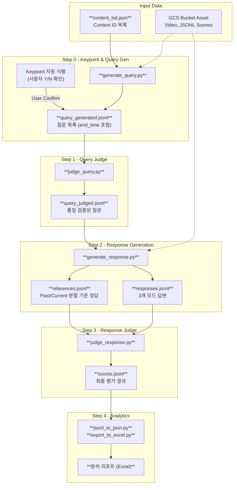

# LLMJudge (Multimodal Interactive Evaluation)

Google Cloud Storage(GCS)에 저장된 영상 및 메타데이터를 활용하여 **실시간 시청 상황을 모사한** 고도화된 질의응답 및 자동 평가 파이프라인(CLI)입니다.

## 📝 프로젝트 개요

이 프로젝트는 시청자가 영상을 중간까지 보다가 질문을 남기는 시각을 자동으로 포착(Keypoint)하고, 해당 시점까지의 **과거 맥락(Past)**과 **현재 장면(Current Focus)**을 분리하여 분석합니다. 이를 통해 더 자연스럽고 상황에 적합한 질문과 답변을 생성하고, 강력한 Gemini 2.5 Pro 모델로 이를 다각도에서 검토합니다.

평가 기준: **정확성(Accuracy)**, **포괄성(Completeness)**, **가독성(Helpfulness)** — 각 1~5점, 총 15점 만점.

## 🔄 파이프라인 흐름



## ✨ 주요 특징

### 1. Past/Current Context 분할 전략
시청자의 인지 과정을 모사하기 위해 데이터를 두 구간으로 나누어 모델에 제공합니다.
- **과거 정보 (Past Information)**: `[0s ~ 현재 Scene 시작]` 구간의 영상/메타데이터. 상황 맥락 파악용.
- **현재 정보 (Current Information)**: `[현재 Scene 시작 ~ end_time]` 구간의 영상/메타데이터. 질문/답변의 직접적인 근거.

### 2. Keypoint 기반 인터랙티브 질문 생성
- `Gemini 2.5 Flash` 모델이 질문 발생 지점(Keypoint)을 자동 식별하여 사용자에게 추천합니다. (진행 여부 Y/N 확인)

### 3. 다중 모드(Multi-mode) 추론 및 평가
- `Video`: 원본 비디오 파일(.mp4)만 제공
- `Full`: 오디오 분류 + ASR + OCR + 행동 묘사(Description) 포함 JSONL
- `Part`: Full에서 행동 묘사를 제외한 JSONL
- **Reference 기반 독립 평가**: Pro 모델이 생성한 기준 정답(텍스트)만으로 비교 평가하여 Judge 단계의 비용과 속도를 최적화했습니다.

### 4. 운영 안정성 및 효율성
- **쿼리 단위 Resume**: (content_id, query) 단위로 실시간 저장. 중단 후 재실행 시 잔여 작업만 처리.
- **자동 재시도 (Retry Loop)**: API Rate Limit(429) 등 일시적 오류 발생 시 성공할 때까지 자동 재시도.
- **병렬 파이프라인 (`--continuous`)**: 각 단계를 독립 터미널에서 동시에 실행 가능.

## 🗂 파일 구조

```text
LLMJudge/
├── main.py                     # E2E 파이프라인 오케스트레이터
├── generate_query.py           # 질문 생성 및 Keypoint 식별
├── judge_query.py              # 생성된 질문 품질 검증
├── generate_response.py        # Reference + 3모드 답변 생성
├── judge_response.py           # Reference 기반 비교 평가
├── gemini_api_utils.py         # Gemini SDK, GCS 검증, 재시도 등 공통 유틸
├── jsonl_to_json.py            # JSONL → 분석용 JSON 변환
├── config.json                 # 환경 설정 (GCP, 모델명 등)
├── content_list.json           # 평가 대상 Content ID 목록
└── assets/                     # 파이프라인 중간 결과 및 최종 스코어
```

## 🚀 설치 및 사전 준비

1. **Python 패키지 설치**
   ```bash
   pip install google-cloud-aiplatform google-cloud-storage vertexai pandas openpyxl
   ```

2. **GCP 인증 및 설정**
   ```bash
   gcloud auth application-default login
   ```
   `config.json`에 GCP 프로젝트 ID와 GCS 버킷 이름을 설정하세요.

3. **GCS 데이터 구조**
   ```text
   gs://{bucket}/video_540p/{content_id}_540p.mp4
   gs://{bucket}/jsonl/{content_id}_15s_Full.jsonl  # 또는 _Ref.jsonl
   ```

## 🎯 실행 방법

### 통합 실행 (권장)
```bash
# 최초 실행 (Keypoint 식별 단계에서 사용자 확인 필요)
python main.py --input_file content_list.json
```

### 각 모듈별 상세 사용법
터미널을 나누어 실시간으로 실행하고 싶을 때 사용합니다.
```bash
# 터미널 1: 질문 생성 (Keypoint 확인 후 Y 입력)
python generate_query.py

# 터미널 2: 답변 생성 (실시간 모니터링 모드)
python generate_response.py --continuous

# 터미널 3: 평가 (실시간 모니터링 모드)
python judge_response.py --continuous
```

## 📊 출력 데이터 상세 예시

### 1. `query_generated.jsonl` (질문 생성 결과)
```json
{"content_id": "v001", "queries": [{"query": "질문 내용", "scene_idx": 5, "start_time": 120.0, "end_time": 135.2}]}
```

### 2. `responses.jsonl` (답변 생성 결과)
```json
{
  "content_id": "v001",
  "query": "질문 내용",
  "start_time": 120.0,
  "end_time": 135.2,
  "scene_idx": 5,
  "answers": { "video": "...", "full": "...", "part": "..." },
  "reference": "Pro 모델의 기준 답변..."
}
```

### 3. `scores_aggregated.json` (최종 요약)
최종 `results/details.xlsx` 및 `results/scores.xlsx`를 통해 시각화된 분석 결과를 확인할 수 있습니다.

---
**LLMJudge Pipeline v3.0** - *Context-aware Multimodal Evaluation*
