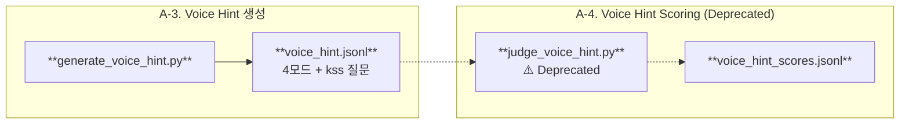
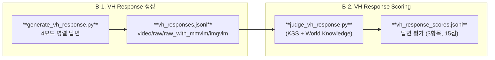

# LLMJudge (Multimodal Interactive Evaluation)

Google Cloud Storage(GCS)에 저장된 영상 및 메타데이터를 활용하여 **실시간 시청 상황을 모사한** 고도화된 질의응답 및 자동 평가 파이프라인(CLI)입니다.

## 📝 프로젝트 개요

이 프로젝트는 시청자가 영상을 중간까지 보다가 질문을 남길 만한 핵심 씬 (KeyScene)을 식별하고, 해당 시점까지의 **과거 맥락(Past)** 과 **현재 장면(Current Focus)** 을 분리하여 분석합니다. 2가지 트랙(A/B)으로 나뉜 평가 파이프라인을 통해, 각각의 입력 모달리티가 얼마나 정확하고 유용한 출력을 생성하는지 공정하게 비교합니다.

### 2-Track 파이프라인

- **A-Track (Voice Hint)**: 현재 장면에 보이는 것만으로 생성되는 시청자의 즉각적인 궁금증
- **B-Track (VH Response)**: Voice Hint 질문에 4개 모달리티로 응답 생성 → KSS + World Knowledge 기반 답변 평가
- ~~**C-Track (KeyScene Description)**~~: Deprecated — `archived/`로 이동됨

---

## 🛡️ 저작권 안전 설계 (Copyright-Safe Architecture)

본 파이프라인의 핵심 설계 원칙 중 하나는 **원본 콘텐츠의 저작권 보호**입니다. 서버측 LLM에 전송되는 데이터에서 원본 대사나 자막이 그대로 노출되면 저작물의 복제·전송에 해당할 수 있으므로, 모드별로 다양한 저작권 보호 전략을 적용합니다.

### 저작권 보호 전략: VLM 구조화 + 파편화 + 마스킹 (imgvlm)

`imgvlm` 모드는 소형 VLM이 영상의 시각 프레임만을 분석하여 추출한 **구조화된 메타데이터**로, 원본 대사/자막과 무관한 시각 정보만을 포함합니다. 3중 보호 전략이 적용됩니다:

1. **구조화 (Structuring)**: VLM 출력을 자유 서술이 아닌 Subjects / Actions / Contexts 3개 필드로 분리
2. **2어절 파편화 (Bigram Fragmentation)**: 각 필드의 텍스트를 2어절 단위로 분할 후 랜덤 셔플하여 문장 순서를 파괴
3. **고유명사 마스킹**: 인물명, 지명, 브랜드 등 고유명사에 `[MASKED]` 토큰을 적용

```
VLM 원문:  "A narwhal swims gracefully through the Arctic waters near ice floes"

구조화 + 파편화 후:
  Subjects: ["near ice", "A narwhal"]                    (셔플됨)
  Actions:  ["gracefully through", "swims [MASKED]"]     (셔플 + 마스킹)
  Contexts: ["ice floes", "the Arctic", "waters near"]   (셔플됨)
```

> **`raw` / `raw_with_mmvlm` 모드**는 원문 ASR/OCR을 그대로 전송하므로, **저작권 계약이 체결된 콘텐츠에 한하여** 사용합니다.

### 4-Mode 데이터 계층

4개 모드가 정의되며, 저작권 안전성과 정보 풍부도의 스펙트럼을 형성합니다.

```
┌─────────────────────────────────────────────────────────┐
│  정보 풍부도 ↑                           저작권 안전성 ↑  │
│  ◄───────────────────────────────────────────────────►  │
│                                                         │
│  video ──── raw ──── raw_with_mmvlm ──── imgvlm         │
│  (영상)   (원문텍스트)  (원문+VLM서술)   (VLM구조화파편)   │
└─────────────────────────────────────────────────────────┘
```

| 모드 | Source | 설명 | 저작권 |
|------|--------|------|:---:|
| `video` | `*_540p.mp4` | GCS 비디오 클립 (VideoMetadata 클리핑) | N/A |
| `raw` | `*_final.jsonl` | Shot별 ASR/OCR을 Scene 단위로 병합 (speech concat + OCR dedup) | ⚠️ 원문 (계약 필요) |
| `raw_with_mmvlm` | `*_final.jsonl` | raw ASR/OCR + VLM 멀티모달 서술 (`vlm_mm_description`) | ⚠️ 원문 + VLM (계약 필요) |
| `imgvlm` | `*_final.jsonl` | VLM 이미지 구조화 메타데이터 (Subjects/Actions/Contexts, 2어절 파편 + `[MASKED]`) | ✅ 안전 |

정규 순서: `video → raw → raw_with_mmvlm → imgvlm` (JSONL 쓰기 및 콘솔 출력)

### raw 모드의 Scene 병합

`raw` 모드는 Shot별로 분산된 ASR/OCR을 **Scene 단위로 통합**하여 LLM에 자연스러운 텍스트로 전달합니다:

```json
{
  "scene_idx": 0,
  "duration": "0.0 - 35.97",
  "speech": "얼어붙었던 바다가 녹아 흩어지기 시작했습니다. 따뜻한 바람과 해류에 얼음이 녹아 깨집니다. ...",
  "on_screen_text": ["© NATIONAL GEOGRAPHIC"]
}
```

- `speech`: 모든 Shot의 `raw_asr`를 시간 순서대로 이어 붙인 통합 텍스트
- `on_screen_text`: 모든 Shot의 `raw_ocr`에서 중복 제거한 고유 텍스트 목록

---

## 🔄 파이프라인 흐름

### 공통 인프라 (A-1, A-2)


### A-Track: Voice Hint Generation



### B-Track: VH Response Generation & Scoring



### ~~C-Track: KeyScene Description~~ (Deprecated)

> KeyScene Description 생성 및 평가 파이프라인은 더 이상 사용하지 않습니다.
> 관련 스크립트(`generate_keyscene_description.py`)는 `archived/`로 이동되었습니다.
> `judge_descriptions.py`는 레거시 데이터 평가용으로 루트에 잔존합니다.

### 파이프라인 요약

| Step | 스크립트 | Output | 모델 |
|------|----------|--------|------|
| A-1 | `identify_keyscene.py` | `keypoint_scenes.jsonl` | Flash Lite |
| A-2 | `generate_keyscene_summary.py` | `keyscene_summary.jsonl` | Pro → Pro |
| A-3 | `generate_voice_hint.py` | `voice_hint.jsonl` | Flash Lite |
| ~~A-4~~ | ~~`judge_voice_hint.py`~~ | ~~`voice_hint_scores.jsonl`~~ | ~~Pro~~ (Deprecated) |
| B-1 | `generate_vh_response.py` | `vh_responses.jsonl` | Flash Lite |
| B-2 | `judge_vh_response.py` | `vh_response_scores.jsonl` | Pro |
| ~~C-1~~ | ~~`generate_keyscene_description.py`~~ | ~~`keyscene_description.jsonl`~~ | ~~Flash Lite~~ (Deprecated → `archived/`) |
| ~~C-2~~ | ~~`judge_descriptions.py`~~ | ~~`keyscene_description_scores.jsonl`~~ | ~~Pro~~ (Deprecated) |
| — | `export_to_excel.py` | Excel 리포트 | — |

---

## ✨ 핵심 설계 전략

### 1. KeyScene 식별: Scene 수에 따른 3경로 분기

| Scene 수 | 경로 | Stage 1 | Stage 2 |
|----------|------|---------|---------|
| ≤ 8개 | A | 전체를 KeyScene으로 자동 지정 | — |
| 9 ~ 17개 | B | 2등분 → 각 세그먼트에서 4개씩 추출 | 단순 결합 |
| ≥ 18개 | C | 3등분 → Candidate 무제한 추출 | Selector가 8개 최종 선별 |

### 2. KeyScene Summary: 2-Phase 세션 아키텍처

```
[Phase 1: 과거 장면 요약] → Pro (thinking: high)
  입력: 이전 KSS + Gap 구간 Ref 메타데이터 (텍스트 only)
       ↓
[Phase 2: 현재 장면 묘사] → Pro (thinking: high)
  입력: 과거 요약 + 현재 Ref JSONL + 현재 비디오 (멀티모달)
```

생성된 KSS는 이후 모든 Judge 파이프라인의 **Ground Truth Anchor**로 재활용됩니다.

### 3. Watch 모드: 파이프라인 병렬 실행

Generation과 Judging 스크립트를 **별도 터미널에서 동시 실행**할 수 있습니다. Judge 스크립트는 `--watch` 플래그로 입력 파일을 증분 모니터링하며, `pipeline_done` 시그널을 감지하면 자동 종료됩니다.

```bash
# 터미널 1: 생성
python generate_vh_response.py

# 터미널 2: 실시간 Judge
python judge_vh_response.py --watch
```

### 4. 자동 평가(Judge): 3-Criteria 통합 루브릭

모든 Judge는 **영문 rationale, flat JSON 구조, 15점 만점**으로 통일됩니다.

#### B-Track: VH Response Judge

| 기준 | 평가 대상 |
|------|----------|
| **Answer Relevance** | 질문에 직접적·실질적으로 답변하는가 |
| **Factual Precision** | 영상 사실 + 외부 지식 모두의 정확도 |
| **Response Quality** | 자연스러움, 구조, 시스템 용어 미노출 |

#### ~~A-Track: Voice Hint Judge~~ (Deprecated)

> Voice Hint는 생성만 수행하며, 자동 평가(Judging)는 더 이상 사용하지 않습니다.

#### ~~C-Track: Description Judge~~ (Deprecated)

> KeyScene Description 평가는 더 이상 사용하지 않습니다. 관련 스크립트는 `archived/`로 이동되었습니다.

---

## 🗂 파일 구조

```text
LLMJudge/
├── main.py                          # E2E 파이프라인 오케스트레이터
├── identify_keyscene.py             # KeyScene Scene 식별 (A-1)
├── generate_keyscene_summary.py     # KeyScene Summary 생성 (A-2)
├── generate_voice_hint.py           # Voice Hint 생성 (A-3)
├── judge_voice_hint.py              # Voice Hint 품질 Judge (Deprecated)
├── generate_vh_response.py          # VH Response 4모드 병렬 생성 (B-1)
├── judge_vh_response.py             # VH Response Judge (B-2)
├── judge_descriptions.py            # Description Judge (Deprecated, 레거시 데이터용)
├── utils.py                         # Gemini SDK, GCS 접근, 공통 유틸
├── export_to_excel.py               # Excel 리포트 생성
├── jsonl_to_json.py                 # JSONL → Pretty JSON 변환 유틸
├── clean_vh_desc.py                 # JSONL 내 특정 모드 삭제 유틸
├── config.json                      # 환경 설정 (GCP, 모델명 등)
├── content_list.json                # 평가 대상 Content ID 목록
├── sample_data/                     # 샘플 JSONL (파편화 데이터)
├── archived/                        # Deprecated 스크립트
│   └── generate_keyscene_description.py  # (Deprecated) KeyScene Description 생성
└── assets/                          # 파이프라인 중간 결과 및 최종 스코어
    ├── keypoint_scenes.jsonl
    ├── keyscene_summary.jsonl
    ├── voice_hint.jsonl
    ├── vh_responses.jsonl
    └── vh_response_scores.jsonl
```

## 🚀 설치 및 사전 준비

1. **Python 패키지 설치**
   ```bash
   pip install google-genai google-cloud-storage pandas openpyxl
   ```

2. **GCP 인증 및 설정**
   ```bash
   gcloud auth application-default login
   ```
   `config.json`에 GCP 프로젝트 ID와 GCS 버킷 이름을 설정하세요.

3. **GCS 데이터 구조**
   ```text
   gs://{bucket}/video_540p/{content_id}_540p.mp4
   gs://{bucket}/jsonl/{content_id}_final.jsonl
   gs://{bucket}/jsonl/{content_id}_ref.jsonl
   ```

4. **`config.json` 주요 설정 키** (sample_config.json 참고)
```json
{
    "gcp_project_id": "your-gcp-project-id",
    "gs_bucket_name": "your-gcs-bucket-name",
    "location": "global",
    "keypoint_model": "gemini-3.1-flash-lite-preview",
    "keypoint_thinking_level": "medium",
    "kss_past_summary_model": "gemini-3.1-pro-preview",
    "kss_past_summary_thinking_level": "high",
    "kss_current_scene_model": "gemini-3.1-pro-preview",
    "kss_current_scene_thinking_level": "high",
    "vh_gen_model": "gemini-3.1-flash-lite-preview",
    "vh_thinking_level": "medium",
    "vh_response_model": "gemini-3.1-flash-lite-preview",
    "vh_response_past_scenes_size": 5,
    "vh_response_thinking_level": "medium",
    "vh_response_judge_model": "gemini-3.1-pro-preview",
    "vh_response_judge_thinking_level": "high"
}
```

## 🎯 실행 방법

### 사전 준비 (모든 Track 공통)

아래 두 스크립트는 **모든 Track의 선행 조건**입니다. B Track 실행 전 반드시 완료해야 합니다.

```bash
python identify_keyscene.py                       # A-1: KeyScene 식별 → keypoint_scenes.jsonl
python generate_keyscene_summary.py               # A-2: KeyScene Summary 생성 → keyscene_summary.jsonl (Ground Truth Anchor)
```

### A-Track (Voice Hint)
```bash
python generate_voice_hint.py                     # A-3: Voice Hint 생성 (기본: kss, raw, raw_with_mmvlm, imgvlm)
# judge_voice_hint.py                             # A-4: Deprecated
```

### B-Track (VH Response)
```bash
python generate_vh_response.py                    # B-1: 4모드 Response 생성 (video, raw, raw_with_mmvlm, imgvlm)
python judge_vh_response.py                       # B-2: Response Judge

# Watch 모드 병렬 실행:
python generate_vh_response.py &                  # 터미널 1
python judge_vh_response.py --watch               # 터미널 2
```

### 통합 실행 (A+B Track)
```bash
python main.py --input_file content_list.json
```

### Analytics
```bash
python export_to_excel.py                         # Excel 리포트 생성
```

## 📊 출력 데이터 예시 (assets/)

### `vh_response_scores.jsonl` (B-Track 평가 결과)
```json
{
  "content_id": "001_NatGeoKR_Narwhal_6m",
  "query": "외뿔고래 이빨이 왜 저렇게 생긴 거야?",
  "judge": {
    "video": {
      "answer_relevance": { "rationale": "Directly addresses...", "score": 5 },
      "factual_precision": { "rationale": "Accurate facts...", "score": 4 },
      "response_quality": { "rationale": "Well-structured...", "score": 5 }
    },
    "raw": { "...": "..." },
    "raw_with_mmvlm": { "...": "..." },
    "imgvlm": { "...": "..." }
  }
}
```
