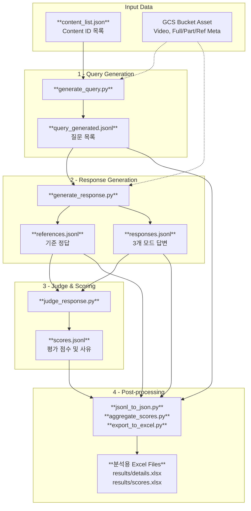

# LLMJudge

Google Cloud Storage(GCS)에 저장된 영상 및 메타데이터를 활용하여 Google Gemini 모델 기반 질의응답을 수행하고, 또 다른 강력한 Gemini 모델을 통해 답변의 품질을 자동 평가하는 파이프라인(CLI)입니다.

## 📝 프로젝트 개요

이 프로젝트는 긴 비디오 영상과 15초 단위 멀티모달 메타데이터(JSONL)를 Gemini 모델에 입력하여 사용자 질문에 대한 답변을 생성하고, Judge 모델을 통해 자동으로 채점합니다.

평가 기준: **정확성(Accuracy)**, **포괄성(Completeness)**, **가독성(Helpfulness)** — 각 1~5점, 총 15점 만점.

## 🔄 파이프라인 흐름



> **Note**: Judge 단계에서는 비디오를 재전송하지 않고, Stage 1에서 생성된 **Reference Answer(텍스트)** 만을 기준으로 각 모드 답변을 비교 평가합니다.

### 세션 구조 상세

| 단계 | 입력 | 세션 구조 |
|------|------|----------|
| **Query 생성** | Video + Ref Meta | Single-turn |
| **Reference 생성** | Video + Ref Meta | 첫 턴에 데이터 전송 이후<br> 쿼리별 Multi-turn |
| **Response 생성** | Video 또는 Meta | Video: Multi-turn </br> Full/Part: Single-turn |
| **Response 평가** | Reference + Mode별 Response | Single-turn |


## ✨ 주요 특징

- **Reference Answer 기반 평가**: Pro 모델이 원본 비디오 + Ref 메타데이터를 참조하여 **기준 정답을 1회 생성**. Judge 모델은 이 텍스트만으로 비교 평가 → Judge 단계에서 비디오 토큰 사용 없음.
- **다중 모드(Multi-mode) 추론**:
  - `Video`: 원본 비디오 파일(.mp4)만 제공
  - `Full`: 오디오 분류 + ASR + OCR + 행동 묘사(Description) 포함 JSONL
  - `Part`: Full에서 행동 묘사를 제외한 JSONL
- **쿼리 단위 Resume**: (content_id, query) 단위로 실시간 답변 Append. 중단 후 재실행 시 잔여 작업만 처리.
- **재시도 로직 (Retry Loop for 429/5xx)**: API Rate Limit 등 일시적 오류 발생 시 10초 간격으로 성공할 때까지 무한 재시도하여 중단 없는 작업 수행 (치명적 오류는 즉시 중지).
- **비동기 병렬 파이프라인 (`--continuous`)**: 각 단계를 독립 터미널에서 동시에 실행하여 이전 단계 출력을 실시간 모니터링.

## 🗂 파일 구조

```text
LLMJudge/
├── main.py                     # E2E 파이프라인 오케스트레이터
├── generate_query.py           # 질문 자동 생성
├── generate_response.py        # Reference + 3모드 답변 생성
├── judge_response.py           # Reference 기반 비교 평가
├── gemini_api_utils.py         # Gemini SDK, GCS 검증, 재시도 등 공통 유틸
├── jsonl_to_json.py            # JSONL → 분석용 JSON 변환
├── config.json                 # 환경 설정 (GCP, 모델명 등)
├── content_list.json           # 평가 대상 Content ID 목록
├── assets/                     # JSONL/JSON 파이프라인 결과 및 분석용 데이터
│   ├── query_generated.jsonl   # 2. 생성된 질문
│   ├── references.jsonl        # 3-A. Reference 답변 (기준 정답)
│   ├── responses.jsonl         # 3-B. 3개 모드 답변 (평가 대상)
│   ├── scores.jsonl            # 4. 최종 평가 점수
│   ├── references.json         # 분석용 포맷 (JSON)
│   ├── responses.json          # 분석용 포맷 (JSON)
│   ├── scores.json             # 분석용 포맷 (JSON)
│   └── scores_aggregated.json  # 5. 비디오별/전체 통계 집계
└── results/                    # 사용자 분석용 최종 엑셀 파일
    ├── details.xlsx            # 상세 결과 (Ref/Resp/Judge/Score)
    └── scores.xlsx             # 통계 요약 결과
```

## 🚀 설치 및 사전 준비

1. **Python 패키지 설치**
   ```bash
   pip install google-cloud-aiplatform google-cloud-storage vertexai pandas openpyxl
   ```

2. **GCP 인증**
   ```bash
   gcloud auth application-default login
   ```

3. **GCS 데이터 구조**
   
   컨텐츠 하나 당 4개의 파일이 필요합니다.
   ```text
   gs://{gs_bucket_name}/video_540p/{content_id}_540p.mp4
   gs://{gs_bucket_name}/jsonl/{content_id}_15s_Full.jsonl
   gs://{gs_bucket_name}/jsonl/{content_id}_15s_Part.jsonl
   gs://{gs_bucket_name}/jsonl/{content_id}_15s_Ref.jsonl
   ```

## 🎯 실행 방법

### 통합 설정 (`config.json` 생성하기)
`sample_config.json`을 복사하여 사용하세요.

```json
{
  "gcp_project_id": "your-gcp-project-id",
  "gs_bucket_name": "your-gcs-bucket-name",
  "location": "global",                         # 3.1 Pro는 global만 가능
  "query_gen_model": "gemini-3.1-pro-preview",  # 질문 생성 모델
  "response_gen_model": "gemini-2.5-flash",     # 답변 생성 모델
  "reference_model": "gemini-3.1-pro-preview",  # 기준 답변 생성 모델
  "judge_model": "gemini-3.1-pro-preview",      # 평가 모델
  "reference_use_ref": true                     # 기준 답변 생성 시 Ref Meta 참조 여부
}
```
- CLI Arguments: 항상 `config.json`보다 우선 적용됩니다.

  | 옵션 | 설명 |
  |------|------|
  | `--skip-response` | 답변 생성 단계 건너뛰기 |
  | `--skip-judge` | 평가 단계 건너뛰기 |

### A. 일괄 실행 (순차 진행)

```bash
# Content ID만 있는 경우 (E2E)
python main.py --generate-query --input_file content_list.json

# Query가 이미 있는 JSONL 파일 입력
python main.py --input_file assets/query_generated.jsonl
```

### B. 병렬 파이프라인 (`--continuous`)

3개 터미널에서 각각 실행:
```bash
# 터미널 1: 질문 생성
python generate_query.py --input_file content_list.json

# 터미널 2: 답변 생성 (실시간 모니터링)
python generate_response.py --continuous

# 터미널 3: 평가 (실시간 모니터링)
python judge_response.py --continuous
```

### 분석용 JSON 및 XLSX 통계 집계

평가 완료 후 `jsonl_to_json.py`, `aggregate_scores.py`, `export_to_excel.py`가 자동으로 실행되어 직관적인 JSON 포맷과 엑셀 분석 결과를 생성합니다.

```bash
# 수동 실행 시
python jsonl_to_json.py --input_dir assets
python aggregate_scores.py --scores_file assets/scores.json --output_file assets/scores_aggregated.json
python export_to_excel.py
```

## 📊 출력 포맷 예시

### `references.json`
```json
{
  "content_id": "001_NatGeoKR_Narwhal_6m",
  "query": "이 영상에서 일각돌고래가 뭐 하는 거야?",
  "reference": "Pro 모델이 생성한 기준 정답 텍스트..."
}
```

### `responses.json`
```json
{
  "content_id": "001_NatGeoKR_Narwhal_6m",
  "query": "이 영상에서 일각돌고래가 뭐 하는 거야?",
  "answers": {
    "video": "영상을 직접 분석한 답변...",
    "full": "Full 메타데이터 기반 답변...",
    "part": "Part 메타데이터 기반 답변..."
  }
}
```

### `scores.json`
```json
{
  "content_id": "001_NatGeoKR_Narwhal_6m",
  "query": "이 영상에서 일각돌고래가 뭐 하는 거야?",
  "judge": {
    "video": { "rationale": "...", "scores": { "accuracy": 4, "completeness": 4, "helpfulness": 5 }, "total_score": 13 },
    "full":  { "rationale": "...", "scores": { "accuracy": 5, "completeness": 5, "helpfulness": 4 }, "total_score": 14 },
    "part":  { "rationale": "...", "scores": { "accuracy": 3, "completeness": 3, "helpfulness": 4 }, "total_score": 10 }
  }
}
```

### `scores_aggregated.json` (비디오별/전체 평균 통계)
```json
{
    "by_video": {
        "001_NatGeoKR_Narwhal_6m": {
            "video": { "accuracy": 4.25, "completeness": 4.1, "helpfulness": 4.8, "total_score": 13.15 },
            "full": { "..." },
            "part": { "..." }
        }
    },
    "overall": {
        "video": { "accuracy": 4.1, "completeness": 4.0, "helpfulness": 4.5, "total_score": 12.6 },
        "full": { "..." },
        "part": { "..." }
    }
}
```
